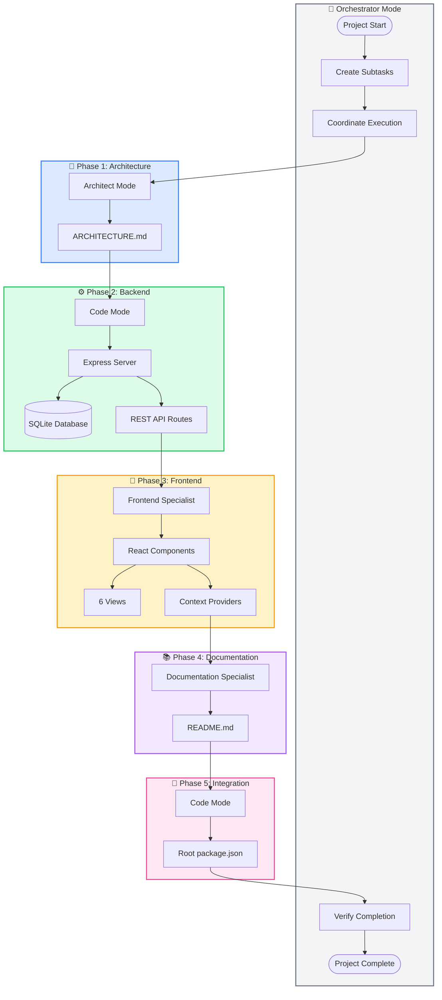
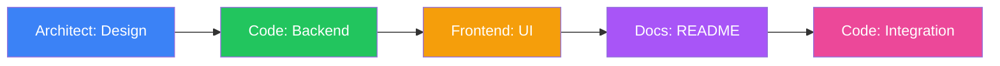

# AI Agent Workflow Documentation

> This document records how Kilo Code AI agents (modes) collaborated to build the TaskFlow project management application. It serves as a transparent record of the orchestrated workflow, agent contributions, and key decisions made during development.

---

## Table of Contents

1. [Overview](#overview)
2. [Feature Updates](#feature-updates)
3. [Agents Used](#agents-used)
4. [Workflow Diagram](#workflow-diagram)
5. [Detailed Agent Contributions](#detailed-agent-contributions)
6. [Key Decisions Made](#key-decisions-made)
7. [Token/Time Estimates](#tokentime-estimates)
8. [Lessons Learned](#lessons-learned)

---

## Overview

**TaskFlow** is a full-stack project management application built entirely through coordinated AI agent collaboration. The project demonstrates how multiple specialized AI modes can work together in sequence to produce a production-ready application.

### Project Summary

- **Type**: Local-first, single-user project management tool
- **Inspiration**: Similar to Jira but simplified for personal use
- **Architecture**: Full-stack with Express backend and React frontend
- **Database**: SQLite for local-first data storage
- **Version**: v1.3.0

### Key Features

- **Project Management**: Create and organize projects with color coding and infinite nesting
- **Task Tracking**: Full task lifecycle with status, priority, due dates, and sub-tasks
- **People Management**: Contact management with project associations
- **Task Assignments**: Primary assignee and co-assignees with roles
- **Task Tags**: Categorize tasks with global or project-specific tags
- **Progress Tracking**: Completion percentage and time estimates (v1.2.0)
- **Notes System**: Markdown notes attached to any entity (v1.2.0)
- **Project Assignments**: Project owner and team members with roles (v1.3.0)
- **Multiple Views**: 6 views (Dashboard, Kanban, List, Calendar, Timeline, People)

### AI Collaboration Model

The project was orchestrated through **Orchestrator Mode**, which coordinated multiple distinct subtasks assigned to specialized AI modes. Each mode contributed its expertise in a sequential workflow with clear dependencies.

---

## Feature Updates

### v1.3.0 - Project Assignments (2026-02-18)

This update adds project-level ownership and team member assignments.

#### New Features

| Feature | Description |
|---------|-------------|
| **Project Owner** | Each project can have an owner (person) assigned via `owner_id` |
| **Project Assignees** | Multiple assignees per project with roles (lead, member, observer) |

#### Files Modified

| File | Changes |
|------|---------|
| [`server/db/schema.js`](server/db/schema.js) | Added `owner_id` column to projects and created `project_assignees` table |
| [`server/db/seed.js`](server/db/seed.js) | Added sample project owners and assignees |
| [`server/routes/projects.js`](server/routes/projects.js) | Added 4 new endpoints for owner/assignees management |
| [`client/src/types/index.ts`](client/src/types/index.ts) | Added `ProjectAssignee` interface and `ProjectAssigneeRole` type |
| [`client/src/services/api.ts`](client/src/services/api.ts) | Added 4 API client methods for project assignments |
| [`client/src/context/ProjectContext.tsx`](client/src/context/ProjectContext.tsx) | Added assignment state and operations |
| [`client/src/components/common/ProjectForm.tsx`](client/src/components/common/ProjectForm.tsx) | Added owner dropdown selector |
| [`client/src/components/common/ProjectTreeNode.tsx`](client/src/components/common/ProjectTreeNode.tsx) | Added owner avatar indicator |
| [`client/src/components/layout/Sidebar.tsx`](client/src/components/layout/Sidebar.tsx) | Added owner avatar next to project names |

#### Database Changes

```sql
-- Add owner_id to projects
ALTER TABLE projects ADD COLUMN owner_id TEXT REFERENCES people(id) ON DELETE SET NULL;
CREATE INDEX IF NOT EXISTS idx_projects_owner ON projects(owner_id);

-- Create project_assignees table
CREATE TABLE IF NOT EXISTS project_assignees (
    id TEXT PRIMARY KEY,
    project_id TEXT NOT NULL,
    person_id TEXT NOT NULL,
    role TEXT DEFAULT 'member' CHECK (role IN ('lead', 'member', 'observer')),
    created_at DATETIME DEFAULT CURRENT_TIMESTAMP,
    FOREIGN KEY (project_id) REFERENCES projects(id) ON DELETE CASCADE,
    FOREIGN KEY (person_id) REFERENCES people(id) ON DELETE CASCADE,
    UNIQUE(project_id, person_id)
);

CREATE INDEX IF NOT EXISTS idx_project_assignees_project ON project_assignees(project_id);
CREATE INDEX IF NOT EXISTS idx_project_assignees_person ON project_assignees(person_id);
```

#### API Endpoints Added

| Endpoint | Method | Description |
|----------|--------|-------------|
| `/api/projects/:id/owner` | PUT | Set project owner (body: `{ personId: string \| null }`) |
| `/api/projects/:id/assignees` | GET | Get all project assignees |
| `/api/projects/:id/assignees` | POST | Add assignee (body: `{ personId: string, role?: string }`) |
| `/api/projects/:id/assignees/:assigneeId` | DELETE | Remove assignee |

#### TypeScript Types Added

```typescript
export type ProjectAssigneeRole = 'lead' | 'member' | 'observer';

export interface ProjectAssignee {
  id: string;
  project_id: string;
  person_id: string;
  role: ProjectAssigneeRole;
  person?: Person;
  created_at: string;
}

// Project interface updated with:
export interface Project {
  // ... existing fields
  owner_id?: string | null;
  owner?: Person;
  assignees?: ProjectAssignee[];
}

export interface CreateProjectAssigneeDTO {
  personId: string;
  role?: ProjectAssigneeRole;
}
```

#### Agents Used for v1.3.0

| Mode | Task | Files Created/Modified |
|------|------|------------------------|
| **Code** | Backend Implementation | [`server/db/schema.js`](server/db/schema.js), [`server/db/seed.js`](server/db/seed.js), [`server/routes/projects.js`](server/routes/projects.js) |
| **Frontend Specialist** | Frontend Implementation | [`client/src/types/index.ts`](client/src/types/index.ts), [`client/src/services/api.ts`](client/src/services/api.ts), [`client/src/context/ProjectContext.tsx`](client/src/context/ProjectContext.tsx) |
| **Documentation Specialist** | Documentation Update | [`README.md`](README.md), [`AGENTS.md`](AGENTS.md) |

---

### v1.2.0 - Nested Hierarchy, Notes & Progress (2026-02-18)

This update adds nested projects/tasks, notes with markdown support, and progress tracking.

#### New Features

| Feature | Description |
|---------|-------------|
| **Nested Projects** | Create infinitely nested sub-projects with parent_project_id |
| **Nested Tasks** | Create infinitely nested sub-tasks with parent_task_id |
| **Notes System** | Markdown notes attached to projects, tasks, or people |
| **Progress Tracking** | Track progress_percent, estimated_duration_minutes, actual_duration_minutes |

#### Files Added

| File | Purpose |
|------|---------|
| [`server/routes/notes.js`](server/routes/notes.js) | Notes CRUD API endpoints |
| [`client/src/context/NoteContext.tsx`](client/src/context/NoteContext.tsx) | Notes state management context |
| [`client/src/components/common/TreeView.tsx`](client/src/components/common/TreeView.tsx) | Generic tree view component |
| [`client/src/components/common/ProjectTreeNode.tsx`](client/src/components/common/ProjectTreeNode.tsx) | Project tree node component |
| [`client/src/components/common/TaskTreeNode.tsx`](client/src/components/common/TaskTreeNode.tsx) | Task tree node component |
| [`client/src/components/common/ProgressBar.tsx`](client/src/components/common/ProgressBar.tsx) | Progress bar component |
| [`client/src/components/common/TaskProgressIndicator.tsx`](client/src/components/common/TaskProgressIndicator.tsx) | Progress editing interface |
| [`client/src/components/common/NoteCard.tsx`](client/src/components/common/NoteCard.tsx) | Note display card |
| [`client/src/components/common/NoteEditor.tsx`](client/src/components/common/NoteEditor.tsx) | Markdown note editor |
| [`client/src/components/common/NotesPanel.tsx`](client/src/components/common/NotesPanel.tsx) | Notes panel for entities |

#### Files Modified

| File | Changes |
|------|---------|
| [`ARCHITECTURE.md`](ARCHITECTURE.md) | Updated schema with hierarchy, notes, and progress fields |
| [`README.md`](README.md) | Added documentation for v1.2.0 features and API endpoints |
| [`server/db/schema.js`](server/db/schema.js) | Added parent_project_id, parent_task_id, progress fields, and notes table |
| [`server/db/seed.js`](server/db/seed.js) | Added sample nested projects, sub-tasks, and notes |
| [`server/routes/projects.js`](server/routes/projects.js) | Added hierarchy endpoints (children, descendants, ancestors, tree, move) |
| [`server/routes/tasks.js`](server/routes/tasks.js) | Added hierarchy and progress endpoints |
| [`server/index.js`](server/index.js) | Registered notes route handler |
| [`client/src/types/index.ts`](client/src/types/index.ts) | Added Note interface, hierarchy fields, progress fields |
| [`client/src/services/api.ts`](client/src/services/api.ts) | Added API client methods for notes, hierarchy, and progress |
| [`client/src/context/ProjectContext.tsx`](client/src/context/ProjectContext.tsx) | Enhanced with hierarchy operations (tree, children, move) |
| [`client/src/context/TaskContext.tsx`](client/src/context/TaskContext.tsx) | Enhanced with hierarchy and progress operations |
| [`client/src/components/common/TaskForm.tsx`](client/src/components/common/TaskForm.tsx) | Added parent task selector and progress fields |
| [`client/src/components/common/ProjectForm.tsx`](client/src/components/common/ProjectForm.tsx) | Added parent project selector |
| [`client/src/components/kanban/TaskCard.tsx`](client/src/components/kanban/TaskCard.tsx) | Added progress bar display |
| [`client/src/components/list/TaskRow.tsx`](client/src/components/list/TaskRow.tsx) | Added progress column |
| [`client/src/components/list/ListView.tsx`](client/src/components/list/ListView.tsx) | Added progress column support |
| [`client/src/App.tsx`](client/src/App.tsx) | Added NoteContext provider |

#### Database Changes

```sql
-- Add parent_project_id to projects for nested projects
ALTER TABLE projects ADD COLUMN parent_project_id TEXT REFERENCES projects(id) ON DELETE RESTRICT;
CREATE INDEX IF NOT EXISTS idx_projects_parent ON projects(parent_project_id);

-- Add parent_task_id to tasks for nested tasks
ALTER TABLE tasks ADD COLUMN parent_task_id TEXT REFERENCES tasks(id) ON DELETE RESTRICT;
CREATE INDEX IF NOT EXISTS idx_tasks_parent ON tasks(parent_task_id);

-- Add progress tracking fields to tasks
ALTER TABLE tasks ADD COLUMN progress_percent INTEGER DEFAULT 0 CHECK (progress_percent >= 0 AND progress_percent <= 100);
ALTER TABLE tasks ADD COLUMN estimated_duration_minutes INTEGER;
ALTER TABLE tasks ADD COLUMN actual_duration_minutes INTEGER;

-- Create notes table for markdown notes attached to any entity
CREATE TABLE IF NOT EXISTS notes (
    id TEXT PRIMARY KEY,
    content TEXT NOT NULL,
    entity_type TEXT NOT NULL CHECK (entity_type IN ('project', 'task', 'person')),
    entity_id TEXT NOT NULL,
    created_by TEXT REFERENCES people(id) ON DELETE SET NULL,
    created_at DATETIME DEFAULT CURRENT_TIMESTAMP,
    updated_at DATETIME DEFAULT CURRENT_TIMESTAMP
);

-- Index for efficient entity-based lookups
CREATE INDEX IF NOT EXISTS idx_notes_entity ON notes(entity_type, entity_id);
CREATE INDEX IF NOT EXISTS idx_notes_created_by ON notes(created_by);
```

#### API Endpoints Added

| Endpoint | Method | Description |
|----------|--------|-------------|
| `/api/notes` | GET | List notes (query: `entity_type`, `entity_id`) |
| `/api/notes/:id` | GET | Get single note |
| `/api/notes` | POST | Create note |
| `/api/notes/:id` | PUT | Update note |
| `/api/notes/:id` | DELETE | Delete note |
| `/api/projects/root` | GET | Get root projects |
| `/api/projects/:id/children` | GET | Get direct children |
| `/api/projects/:id/descendants` | GET | Get all descendants |
| `/api/projects/:id/ancestors` | GET | Get all ancestors |
| `/api/projects/:id/tree` | GET | Get full tree |
| `/api/projects/:parentId/subprojects` | POST | Create sub-project |
| `/api/projects/:id/move` | PUT | Move to new parent |
| `/api/tasks/:id/children` | GET | Get direct children |
| `/api/tasks/:id/descendants` | GET | Get all descendants |
| `/api/tasks/:id/ancestors` | GET | Get all ancestors |
| `/api/tasks/:id/tree` | GET | Get full tree |
| `/api/tasks/:parentId/subtasks` | POST | Create sub-task |
| `/api/tasks/:id/move` | PUT | Move to new parent |
| `/api/tasks/:id/progress` | PUT | Update progress |
| `/api/tasks/:id/progress/rollup` | GET | Get progress including children |
| `/api/projects/:id/tasks/root` | GET | Get root tasks for project |

---

### v1.1.0 - People, Tags & Assignees (2026-02-18)

This update adds contact management and task assignment capabilities to TaskFlow.

#### New Features

| Feature | Description |
|---------|-------------|
| **People Management** | Create and manage contacts (not users) with name, email, company, designation, and project association |
| **Task Assignments** | Set primary assignee and co-assignees with roles (collaborator, reviewer, observer) |
| **Task Tags** | Categorize tasks with custom tags that can be global or project-specific |
| **People View** | New dedicated view for managing contacts with search and filtering capabilities |

#### Files Added

| File | Purpose |
|------|---------|
| [`server/routes/people.js`](server/routes/people.js) | People CRUD API endpoints |
| [`server/routes/tags.js`](server/routes/tags.js) | Tags CRUD API endpoints |
| [`client/src/context/PeopleContext.tsx`](client/src/context/PeopleContext.tsx) | People state management context |
| [`client/src/context/TagContext.tsx`](client/src/context/TagContext.tsx) | Tag state management context |
| [`client/src/components/people/PeopleView.tsx`](client/src/components/people/PeopleView.tsx) | People management view component |
| [`client/src/components/common/PersonForm.tsx`](client/src/components/common/PersonForm.tsx) | Person creation/edit form |
| [`client/src/components/common/TagForm.tsx`](client/src/components/common/TagForm.tsx) | Tag creation/edit form |

#### Files Modified

| File | Changes |
|------|---------|
| [`ARCHITECTURE.md`](ARCHITECTURE.md) | Updated schema with people, tags, task_assignees, task_tags tables |
| [`README.md`](README.md) | Added documentation for new features and API endpoints |
| [`server/db/schema.js`](server/db/schema.js) | Added new tables and indexes |
| [`server/db/seed.js`](server/db/seed.js) | Added sample people, tags, and assignments |
| [`server/routes/tasks.js`](server/routes/tasks.js) | Added assignee and tag endpoints |
| [`server/index.js`](server/index.js) | Registered new route handlers |
| [`client/src/types/index.ts`](client/src/types/index.ts) | Added TypeScript interfaces for new entities |
| [`client/src/services/api.ts`](client/src/services/api.ts) | Added API client methods for people and tags |
| [`client/src/context/TaskContext.tsx`](client/src/context/TaskContext.tsx) | Enhanced with assignee and tag support |
| [`client/src/components/common/TaskForm.tsx`](client/src/components/common/TaskForm.tsx) | Added assignee and tag selection fields |
| [`client/src/components/common/Badge.tsx`](client/src/components/common/Badge.tsx) | Enhanced for tag display |
| [`client/src/components/kanban/TaskCard.tsx`](client/src/components/kanban/TaskCard.tsx) | Added assignee and tag display |
| [`client/src/components/list/TaskRow.tsx`](client/src/components/list/TaskRow.tsx) | Added assignee and tag columns |
| [`client/src/components/list/ListView.tsx`](client/src/components/list/ListView.tsx) | Updated with new columns |
| [`client/src/components/list/FilterBar.tsx`](client/src/components/list/FilterBar.tsx) | Added assignee and tag filters |
| [`client/src/components/layout/Sidebar.tsx`](client/src/components/layout/Sidebar.tsx) | Added People navigation item |
| [`client/src/App.tsx`](client/src/App.tsx) | Added People view route |

#### Agents Used for v1.1.0

| Mode | Task | Files Created/Modified |
|------|------|------------------------|
| **Architect** | Schema Design | [`ARCHITECTURE.md`](ARCHITECTURE.md) |
| **Code** | Backend Implementation | [`server/db/schema.js`](server/db/schema.js), [`server/db/seed.js`](server/db/seed.js), [`server/routes/people.js`](server/routes/people.js), [`server/routes/tags.js`](server/routes/tags.js), [`server/routes/tasks.js`](server/routes/tasks.js), [`server/index.js`](server/index.js) |
| **Frontend Specialist** | Frontend Implementation | [`client/src/types/index.ts`](client/src/types/index.ts), [`client/src/services/api.ts`](client/src/services/api.ts), [`client/src/context/PeopleContext.tsx`](client/src/context/PeopleContext.tsx), [`client/src/context/TagContext.tsx`](client/src/context/TagContext.tsx), [`client/src/context/TaskContext.tsx`](client/src/context/TaskContext.tsx), [`client/src/components/people/PeopleView.tsx`](client/src/components/people/PeopleView.tsx), [`client/src/components/common/PersonForm.tsx`](client/src/components/common/PersonForm.tsx), [`client/src/components/common/TagForm.tsx`](client/src/components/common/TagForm.tsx), [`client/src/components/common/TaskForm.tsx`](client/src/components/common/TaskForm.tsx), [`client/src/components/common/Badge.tsx`](client/src/components/common/Badge.tsx), [`client/src/components/kanban/TaskCard.tsx`](client/src/components/kanban/TaskCard.tsx), [`client/src/components/list/TaskRow.tsx`](client/src/components/list/TaskRow.tsx), [`client/src/components/list/ListView.tsx`](client/src/components/list/ListView.tsx), [`client/src/components/list/FilterBar.tsx`](client/src/components/list/FilterBar.tsx), [`client/src/components/layout/Sidebar.tsx`](client/src/components/layout/Sidebar.tsx), [`client/src/App.tsx`](client/src/App.tsx) |
| **Documentation Specialist** | Documentation Update | [`README.md`](README.md) |

#### Database Changes

```sql
-- New people table for contacts
CREATE TABLE people (
    id TEXT PRIMARY KEY,
    name TEXT NOT NULL,
    email TEXT,
    company TEXT,
    designation TEXT,
    project_id TEXT,
    created_at DATETIME,
    updated_at DATETIME,
    FOREIGN KEY (project_id) REFERENCES projects(id)
);

-- New tags table for task categorization
CREATE TABLE tags (
    id TEXT PRIMARY KEY,
    name TEXT NOT NULL,
    color TEXT DEFAULT '#6B7280',
    project_id TEXT,
    created_at DATETIME,
    updated_at DATETIME,
    FOREIGN KEY (project_id) REFERENCES projects(id)
);

-- New task_assignees table for co-assignees
CREATE TABLE task_assignees (
    id TEXT PRIMARY KEY,
    task_id TEXT NOT NULL,
    person_id TEXT NOT NULL,
    role TEXT DEFAULT 'collaborator',
    created_at DATETIME,
    FOREIGN KEY (task_id) REFERENCES tasks(id),
    FOREIGN KEY (person_id) REFERENCES people(id)
);

-- New task_tags table for task-tag relationships
CREATE TABLE task_tags (
    id TEXT PRIMARY KEY,
    task_id TEXT NOT NULL,
    tag_id TEXT NOT NULL,
    created_at DATETIME,
    FOREIGN KEY (task_id) REFERENCES tasks(id),
    FOREIGN KEY (tag_id) REFERENCES tags(id)
);

-- Added assignee_id column to tasks table
ALTER TABLE tasks ADD COLUMN assignee_id TEXT REFERENCES people(id);

-- Added indexes for new columns
CREATE INDEX idx_people_project ON people(project_id);
CREATE INDEX idx_tags_project ON tags(project_id);
CREATE INDEX idx_task_assignees_task ON task_assignees(task_id);
CREATE INDEX idx_task_assignees_person ON task_assignees(person_id);
CREATE INDEX idx_task_tags_task ON task_tags(task_id);
CREATE INDEX idx_task_tags_tag ON task_tags(tag_id);
CREATE INDEX idx_tasks_assignee ON tasks(assignee_id);
```

#### API Endpoints Added

| Endpoint | Method | Description |
|----------|--------|-------------|
| `/api/people` | GET | List all people (optional `?project_id=` filter) |
| `/api/people/:id` | GET | Get single person |
| `/api/people` | POST | Create new person |
| `/api/people/:id` | PUT | Update person |
| `/api/people/:id` | DELETE | Delete person |
| `/api/tags` | GET | List all tags (optional `?project_id=` filter) |
| `/api/tags/:id` | GET | Get single tag |
| `/api/tags` | POST | Create new tag |
| `/api/tags/:id` | PUT | Update tag |
| `/api/tags/:id` | DELETE | Delete tag |
| `/api/tasks/:id/assignee` | PUT | Set primary assignee |
| `/api/tasks/:id/assignees` | GET | Get co-assignees |
| `/api/tasks/:id/assignees` | POST | Add co-assignee |
| `/api/tasks/:id/assignees/:assigneeId` | DELETE | Remove co-assignee |
| `/api/tasks/:id/tags` | GET | Get task tags |
| `/api/tasks/:id/tags` | POST | Add tag to task |
| `/api/tasks/:id/tags/:tagId` | DELETE | Remove tag from task |

---

## Agents Used

| Mode | Task | Files Created/Modified | Description |
|------|------|------------------------|-------------|
| **Architect** | System Design | [`ARCHITECTURE.md`](ARCHITECTURE.md) | Created comprehensive architecture documentation including tech stack, database schema, API specs, and component hierarchy |
| **Code** | Backend Implementation | [`server/index.js`](server/index.js), [`server/db/database.js`](server/db/database.js), [`server/db/schema.js`](server/db/schema.js), [`server/db/seed.js`](server/db/seed.js), [`server/routes/projects.js`](server/routes/projects.js), [`server/routes/tasks.js`](server/routes/tasks.js), [`server/package.json`](server/package.json) | Built Express server with SQLite database, RESTful API routes, and seed data |
| **Frontend Specialist** | Frontend Implementation | [`client/src/`](client/src/) (entire directory) | Created React + TypeScript + Tailwind frontend with all views, components, contexts, and services |
| **Documentation Specialist** | Documentation | [`README.md`](README.md) | Created comprehensive documentation with setup instructions, API docs, and usage guides |
| **Code** (Final) | Root Configuration | [`package.json`](package.json) | Created root package.json with concurrent scripts for running both servers |

---

## Workflow Diagram

The following Mermaid diagram illustrates the orchestrated workflow:



### Task Dependencies



---

## Detailed Agent Contributions

### 📐 Architect Mode

**Role**: System architecture and technical specification

**Output**: [`ARCHITECTURE.md`](ARCHITECTURE.md) (~81,000 characters)

**Contributions**:

1. **Technology Stack Decisions**
   - Frontend: React 18, TypeScript, Vite, Tailwind CSS
   - Backend: Express.js, better-sqlite3
   - Key libraries: @dnd-kit, recharts, react-big-calendar

2. **Database Schema Design**
   ```sql
   -- Projects table with color coding and hierarchy
   CREATE TABLE projects (
       id TEXT PRIMARY KEY,
       name TEXT NOT NULL,
       description TEXT,
       color TEXT DEFAULT '#3B82F6',
       parent_project_id TEXT REFERENCES projects(id),
       created_at DATETIME,
       updated_at DATETIME
   );
   
   -- Tasks table with status tracking, hierarchy, and progress
   CREATE TABLE tasks (
       id TEXT PRIMARY KEY,
       project_id TEXT NOT NULL,
       parent_task_id TEXT REFERENCES tasks(id),
       title TEXT NOT NULL,
       status TEXT DEFAULT 'todo',
       priority TEXT DEFAULT 'medium',
       progress_percent INTEGER DEFAULT 0,
       estimated_duration_minutes INTEGER,
       actual_duration_minutes INTEGER,
       due_date DATE,
       start_date DATE,
       assignee_id TEXT REFERENCES people(id),
       FOREIGN KEY (project_id) REFERENCES projects(id)
   );
   
   -- Notes table for markdown notes
   CREATE TABLE notes (
       id TEXT PRIMARY KEY,
       content TEXT NOT NULL,
       entity_type TEXT NOT NULL CHECK (entity_type IN ('project', 'task', 'person')),
       entity_id TEXT NOT NULL,
       created_by TEXT REFERENCES people(id) ON DELETE SET NULL,
       created_at DATETIME DEFAULT CURRENT_TIMESTAMP,
       updated_at DATETIME DEFAULT CURRENT_TIMESTAMP
   );
   ```

3. **API Endpoint Specifications**
   - Projects: CRUD operations at `/api/projects` with hierarchy endpoints
   - Tasks: CRUD operations at `/api/tasks` with hierarchy, filtering, and progress endpoints
   - Notes: CRUD operations at `/api/notes` with entity-based filtering
   - Consistent response format: `{ success, data/error }`

4. **Component Hierarchy**
   - Layout components: Layout, Header, Sidebar
   - Common components: Button, Modal, Card, Badge, TreeView, ProgressBar, NoteEditor, TaskForm, ProjectForm
   - View-specific components for each of 6 views

5. **State Management Strategy**
   - React Context API with multiple providers
   - AppContext, ProjectContext, TaskContext, PeopleContext, TagContext, NoteContext
   - Centralized state with CRUD operations

---

### ⚙️ Code Mode (Backend)

**Role**: Backend implementation

**Files Created**:

| File | Purpose |
|------|---------|
| [`server/index.js`](server/index.js) | Express server entry point with CORS and JSON parsing |
| [`server/db/database.js`](server/db/database.js) | SQLite connection using better-sqlite3 |
| [`server/db/schema.js`](server/db/schema.js) | Table creation with indexes including v1.2.0 schema |
| [`server/db/seed.js`](server/db/seed.js) | Sample data including nested projects/tasks and notes |
| [`server/routes/projects.js`](server/routes/projects.js) | Project CRUD endpoints with hierarchy operations |
| [`server/routes/tasks.js`](server/routes/tasks.js) | Task CRUD endpoints with hierarchy and progress |
| [`server/routes/notes.js`](server/routes/notes.js) | Notes CRUD endpoints (v1.2.0) |
| [`server/package.json`](server/package.json) | Backend dependencies |

**Key Implementation Details**:

```javascript
// server/index.js - Server setup
const express = require('express');
const cors = require('cors');
const projectsRouter = require('./routes/projects');
const tasksRouter = require('./routes/tasks');
const notesRouter = require('./routes/notes');

const app = express();
app.use(cors());
app.use(express.json());
app.use('/api/projects', projectsRouter);
app.use('/api/tasks', tasksRouter);
app.use('/api/notes', notesRouter);
```

**API Features**:
- Full CRUD for projects and tasks
- Query parameter filtering for tasks
- Dedicated status update endpoint
- Hierarchy operations (children, descendants, ancestors, tree, move)
- Progress tracking and rollup calculations
- Notes attached to any entity
- Automatic timestamp management

---

### 🎨 Frontend Specialist Mode

**Role**: Complete React frontend implementation

**Directory Structure Created**:

```
client/src/
├── main.tsx              # Entry point
├── App.tsx               # Root component with routing
├── index.css             # Global styles + Tailwind
├── types/
│   └── index.ts          # TypeScript interfaces (including v1.2.0 types)
├── services/
│   └── api.ts            # API client with fetch (including v1.2.0 endpoints)
├── context/
│   ├── AppContext.tsx    # View/UI state
│   ├── ProjectContext.tsx # Project state with hierarchy
│   ├── TaskContext.tsx   # Task state + filtering + hierarchy + progress
│   ├── PeopleContext.tsx # People state (v1.1.0)
│   ├── TagContext.tsx    # Tag state (v1.1.0)
│   └── NoteContext.tsx   # Note state (v1.2.0)
└── components/
    ├── common/           # Reusable components (including v1.2.0 TreeView, ProgressBar, Notes)
    ├── layout/           # Layout structure
    ├── kanban/           # Kanban board
    ├── list/             # List view
    ├── calendar/         # Calendar view
    ├── timeline/         # Timeline/Gantt
    ├── dashboard/        # Dashboard stats
    └── people/           # People view (v1.1.0)
```

**Key Files Implemented**:

| Component Category | Files | Features |
|-------------------|-------|----------|
| **Common** | [`Button.tsx`](client/src/components/common/Button.tsx), [`Modal.tsx`](client/src/components/common/Modal.tsx), [`Card.tsx`](client/src/components/common/Card.tsx), [`Badge.tsx`](client/src/components/common/Badge.tsx), [`TreeView.tsx`](client/src/components/common/TreeView.tsx) (v1.2.0), [`ProgressBar.tsx`](client/src/components/common/ProgressBar.tsx) (v1.2.0), [`NoteEditor.tsx`](client/src/components/common/NoteEditor.tsx) (v1.2.0), [`TaskForm.tsx`](client/src/components/common/TaskForm.tsx), [`ProjectForm.tsx`](client/src/components/common/ProjectForm.tsx), [`PersonForm.tsx`](client/src/components/common/PersonForm.tsx), [`TagForm.tsx`](client/src/components/common/TagForm.tsx) | Reusable UI components with variants |
| **Layout** | [`Layout.tsx`](client/src/components/layout/Layout.tsx), [`Header.tsx`](client/src/components/layout/Header.tsx), [`Sidebar.tsx`](client/src/components/layout/Sidebar.tsx) | App shell with navigation |
| **Kanban** | [`KanbanBoard.tsx`](client/src/components/kanban/KanbanBoard.tsx), [`KanbanColumn.tsx`](client/src/components/kanban/KanbanColumn.tsx), [`TaskCard.tsx`](client/src/components/kanban/TaskCard.tsx) | Drag-and-drop board with @dnd-kit |
| **List** | [`ListView.tsx`](client/src/components/list/ListView.tsx), [`FilterBar.tsx`](client/src/components/list/FilterBar.tsx), [`TaskRow.tsx`](client/src/components/list/TaskRow.tsx), [`SortHeader.tsx`](client/src/components/list/SortHeader.tsx) | Sortable, filterable table |
| **Calendar** | [`CalendarView.tsx`](client/src/components/calendar/CalendarView.tsx), [`TaskEvent.tsx`](client/src/components/calendar/TaskEvent.tsx) | Monthly calendar with react-big-calendar |
| **Timeline** | [`TimelineView.tsx`](client/src/components/timeline/TimelineView.tsx), [`TimelineTask.tsx`](client/src/components/timeline/TimelineTask.tsx) | Gantt-style timeline |
| **Dashboard** | [`DashboardView.tsx`](client/src/components/dashboard/DashboardView.tsx), [`StatCard.tsx`](client/src/components/dashboard/StatCard.tsx), [`UpcomingDeadlines.tsx`](client/src/components/dashboard/UpcomingDeadlines.tsx) | Statistics with recharts |
| **People** (v1.1.0) | [`PeopleView.tsx`](client/src/components/people/PeopleView.tsx) | Contact management with search and filtering |

**State Management Implementation**:

```typescript
// context/TaskContext.tsx - Extended context structure with v1.2.0 features
interface TaskContextType {
  tasks: Task[];
  filteredTasks: Task[];
  loading: boolean;
  filters: TaskFilters;
  setFilters: (filters: TaskFilters) => void;
  
  // Basic CRUD
  fetchTasks: (projectId?: string) => Promise<void>;
  createTask: (data: CreateTaskDTO) => Promise<Task>;
  updateTask: (id: string, data: UpdateTaskDTO) => Promise<Task>;
  updateTaskStatus: (id: string, status: TaskStatus) => Promise<Task>;
  deleteTask: (id: string) => Promise<void>;
  
  // Hierarchy operations (v1.2.0)
  fetchTaskTree: (projectId: string) => Promise<void>;
  createSubTask: (parentId: string, data: CreateSubTaskDTO) => Promise<Task>;
  moveTask: (taskId: string, newParentId: string | null) => Promise<Task>;
  
  // Progress operations (v1.2.0)
  updateProgress: (taskId: string, data: UpdateProgressDTO) => Promise<Task>;
  fetchProgressRollup: (taskId: string) => Promise<TaskProgressRollup>;
}
```

---

### 📚 Documentation Specialist Mode

**Role**: Comprehensive project documentation

**Output**: [`README.md`](README.md) (~35,000 characters), [`AGENTS.md`](AGENTS.md) (this file)

**Documentation Sections**:

1. **Feature Overview**
   - Screenshots placeholders
   - Core functionality list
   - Six view descriptions (Dashboard, Kanban, List, Calendar, Timeline, People)
   - v1.2.0 features (Nested Hierarchy, Progress Tracking, Notes)

2. **Tech Stack Table**
   - Backend technologies
   - Frontend technologies
   - Key libraries with purposes

3. **Installation & Setup**
   - Prerequisites check
   - Step-by-step installation
   - Development server instructions

4. **Usage Guide**
   - Creating projects and tasks
   - Creating sub-projects and sub-tasks
   - Progress tracking
   - Adding notes
   - View navigation

5. **API Documentation**
   - All endpoints documented
   - Project Hierarchy API
   - Task Hierarchy API
   - Notes API (v1.2.0)
   - Progress Tracking API (v1.2.0)
   - Request/response examples

6. **Database Schema**
   - Table structures including v1.2.0 additions
   - Column descriptions

7. **Project Structure**

---

### 6 |                  Verify.notNull(entityId, "Entity id must not be null.");
                  val orchestrator = orchestrator as? HierarchyViewOrchestrator<T> ? T.instanceType,
       .FindByIdOrException
            });
        }

        val templateIndependentRequest = buildTemplateIndependentRequest(
            loadParts = loadParts,
            userId = userId,
            assigned = assigned,
            includeFullMonth = includeFullMonth,
            displayEmptyWDays = displayEmptyWDays,
            useWeekHeaders = useWeekHeaders
        )
        when ((entityId: EntityId?)?.instanceType) {
            InstanceType.UNDEFINED -> {}
            InstanceType.PROJECT -> templateIndependentRequest.childMenuFilterProvider = CalendarMenuFilterProvider.RelatedToProject(userId, entityId, taskTypeProvider)
            InstanceType.TASK -> templateIndependentRequest.childMenuFilterProvider = CalendarMenuFilterProvider.RelatedToTask(userId, entityId, taskTypeProvider)
            else -> throw IllegalArgumentException("entityId must be of instance type PROJECT or TASK")
        }
        return api.compileViewMenuItems(templateIndependentRequest)
    }

    override fun getListToViewMappings()])
        .single { (v as? GanttView)?.taskTypeProvider == taskTypeProvider }!!

    private fun buildTemplateIndependentRequest(
        loadParts: List<LoadPart>,
        userId: UserId,
        assigned: Set<TaskTreeNode>,
        includeFullMonth: Boolean,
        displayEmptyWDays: Boolean,
        useWeekHeaders: Boolean
    ) = ListToViewMappingRequest(
        userId,
        loadParts,
        GanttMenuProvider.TemplateIndependent(
            TaskOrchestrator.saveParts(taskTypeProvider, assigned),
            maxMonthDays = impl.getMaxMonthDays().toInt(),
            includeFullMonth,
            displayEmptyWDays,
            useWeekHeaders,
            scrollModeProvider,
            CustomMenuItemProvider,
            taskIdTypeProvider = taskTypeProvider,
            timelineTypeProvider = timelineTypeProvider,
            bridge = Bridge
        )
    )
}

@DslMarker
annotation class CalendarMenuDsl

fun CalendarMenuForm(
    user: User,
    project: Project,
    assigned: Set<TaskTreeNode>,
    builder: CalendarMenuForm.() -> Unit
) = CalendarMenuForm(user = user).let { form -> CalendarMenuFormImpl(form).apply(builder).form }

class CalendarMenuFormImpl(form: CalendarMenuForm, viewFactory: Api.CalendarMenuViewFactory.Available) {
    val form = form
    val bridge = viewFactory
    var CalendarMenuForm.loadedData by Delegates.notNull<CalendarMenuForm.LoadedData>()
        private set
    val CustomMenuItemProvider: CalendarMenuForm.CustomMenuItemProvider by Delegates.notNull<CalendarMenuForm.CustomMenuItemProvider>()
        private set
    val MenuItemProvider: CalendarMenuItemProvider by Delegates.notNull<CalendarMenuItemProvider>()
        private set
    val DatePickerProvider: DatePicker by Delegates.notNull<DatePickerProvider>()
        private set
    val HeaderTitleProvider: HeaderTitleProvider by Delegates.notNull<HeaderTitleProvider>()
        private set
    val ScrollingProvider: ScrollingProvider by Delegates.notNull<ScrollingProvider>()
        private set
    val MenuProvider: MenuProvider by Delegates.notNull<MenuProvider>()
        private set
    val NotificationsProvider: NotificationProvider by Delegates.notNull<NotificationProvider>()
        private set
    val ReportsProvider: ReportsProvider by Delegates.notNull<ReportsProvider>()
        private set
    val Theme by Delegates.notNull<Theme>()
        private set

    fun loadedData(data: CalendarMenuForm.LoadedData) = apply { this.loadedData = data }
    fun theme(theme: Theme) = apply { this.Theme = theme }
    fun customMenuItem(customMenuItem: CalendarMenuForm.CustomMenuItemProvider) = apply { this.CustomMenuItemProvider = customMenuItem }
    fun menuItem(menuItem: CalendarMenuItemProvider) = apply { this.MenuItemProvider = menuItem }
    fun scrolling(scrolling: ScrollingProvider) = apply { this.ScrollingProvider = scrolling }
    fun date(datePicker: DatePicker) = apply { this.DatePickerProvider = datePicker }
    fun title(headerTitle: HeaderTitleProvider) = apply { this.HeaderTitleProvider = headerTitle }
    fun notifications(notifications: NotificationProvider) = apply { this.NotificationsProvider = notifications }
    fun reports(reports: ReportsProvider) = apply { this.ReportsProvider = reports }
}
