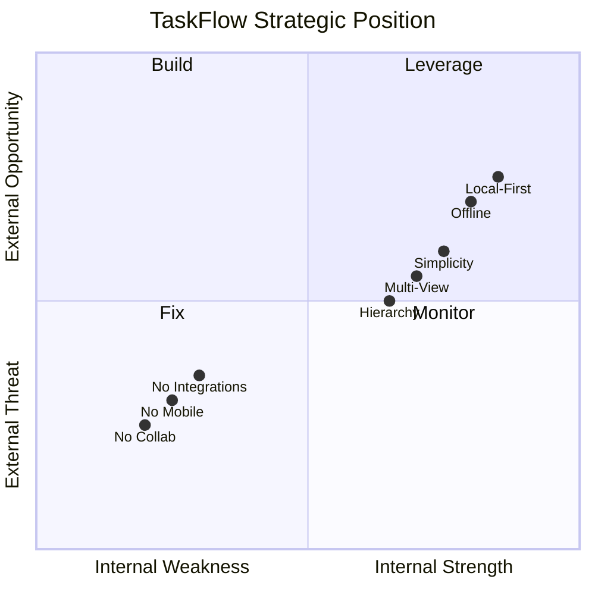
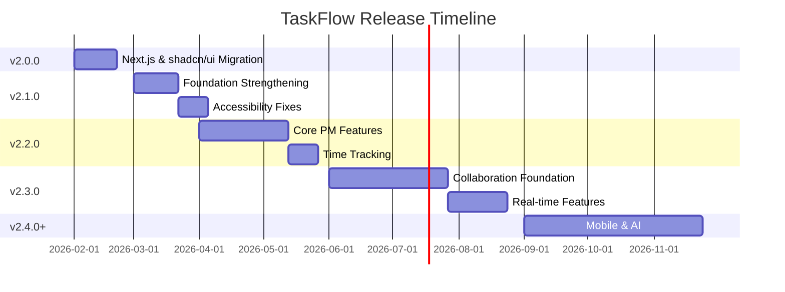
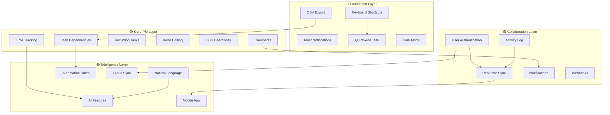

# TaskFlow Product Roadmap

**Version:** v2.0.0 → Future Releases  
**Document Date:** February 2026  
**Status:** Strategic Planning Document

---

## Table of Contents

1. [Executive Summary](#1-executive-summary)
2. [Current State Assessment](#2-current-state-assessment)
3. [Prioritized Feature Roadmap](#3-prioritized-feature-roadmap)
   - [Quick Wins (1-3 Days)](#31-🔴-quick-wins-1-3-days-implementation)
   - [Major Feature Releases (1-4 Weeks)](#32-🟡-major-feature-releases-1-4-weeks-implementation)
   - [Long-term Roadmap (1-6 Months)](#33-🟢-long-term-roadmap-1-6-months-implementation)
4. [Version Release Plan](#4-version-release-plan)
5. [Feature Specifications](#5-feature-specifications)
6. [Success Metrics](#6-success-metrics)
7. [Risk Assessment](#7-risk-assessment)
8. [Appendices](#8-appendices)

---

## 1. Executive Summary

### 1.1 Document Purpose

This roadmap synthesizes findings from two comprehensive audits:
- **UX Audit** - Evaluating user experience maturity and pain points
- **Product Strategy & Competitive Audit** - Analyzing market position and feature gaps

The document provides a prioritized, actionable development plan for TaskFlow's evolution from v2.0.0 through v2.2.0+.

### 1.2 Current State: TaskFlow v2.0.0

TaskFlow is a **local-first, single-user project management tool** positioned as a simplified Jira alternative. Built entirely through AI agent collaboration, it demonstrates a unique development approach while delivering production-ready functionality.

| Aspect | Status |
|--------|--------|
| **Architecture** | Full-stack (Express + Next.js 15 + SQLite) |
| **UI Framework** | shadcn/ui with Radix UI primitives |
| **Core Features** | 6 views, infinite nesting, progress tracking, notes, assignments |
| **Differentiator** | Local-first with offline capability |
| **Maturity Level** | Feature-complete for single-user personal PM |

#### v2.0.0 - Next.js & shadcn/ui Migration (Completed: February 2026)

The v2.0.0 release represents a major frontend architecture modernization:

| Migration Item | Previous | Current |
|---------------|----------|---------|
| **Framework** | Vite + React SPA | Next.js 15 with App Router |
| **Routing** | react-router-dom | File-based routing (`app/` directory) |
| **UI Components** | Custom components | shadcn/ui (Badge, Button, Card, Dialog, DropdownMenu) |
| **Styling** | Custom CSS | Tailwind CSS with CSS variables |
| **API Handling** | Direct fetch | Next.js API rewrites/proxying |

**Key Files Created:**
- [`client/src/app/layout.tsx`](client/src/app/layout.tsx) - Root layout with providers
- [`client/src/app/providers.tsx`](client/src/app/providers.tsx) - Context providers wrapper
- [`client/src/app/global-ui.tsx`](client/src/app/global-ui.tsx) - Global UI elements
- [`client/src/components/ui/`](client/src/components/ui/) - shadcn/ui components

**Key Files Modified:**
- [`client/package.json`](client/package.json) - Updated for Next.js dependencies
- [`client/tsconfig.json`](client/tsconfig.json) - Updated for Next.js configuration

**Key Files Removed:**
- `client/vite.config.ts` - Replaced by Next.js configuration
- `client/index.html` - Next.js handles HTML generation
- `client/src/main.tsx` - Replaced by App Router entry points

### 1.3 Key Audit Findings Summary

#### UX Audit Results

**Overall UX Maturity Score: 6.5/10**

| Category | Score | Status |
|----------|-------|--------|
| Navigation & IA | 7/10 | Good |
| Interaction Patterns | 6/10 | Needs Work |
| Accessibility | 6/10 | Needs Work |
| Visual Consistency | 8/10 | Strong |
| Onboarding/Discoverability | 4/10 | **Critical** |
| Mobile/Responsive | 7/10 | Good |

**Top UX Pain Points:**
1. Task form complexity (15+ fields, no progressive disclosure)
2. No inline editing capabilities
3. Missing keyboard shortcuts
4. No bulk operations
5. Critical onboarding gaps

#### Product Strategy Results

**Market Position:**

```
┌─────────────────────────────────────────────────────────────┐
│                    PM TOOL LANDSCAPE                        │
├─────────────────────────────────────────────────────────────┤
│  Enterprise         │ TaskFlow        │ Personal            │
│  ──────────         │ Opportunity     │ ─────────           │
│  Jira               │    ┌─────┐      │ Todoist             │
│  ClickUp            │    │LOCAL│      │ Things              │
│  Asana              │    │FIRST│      │ Apple Reminders     │
│                     │    │ +   │      │                     │
│  Modern             │    │SMART│      │ Traditional         │
│  ──────────         │    └─────┘      │ ─────────           │
│  Linear             │                 │ MS Project          │
│  Notion             │                 │ Excel               │
└─────────────────────────────────────────────────────────────┘
```

**Competitive Gap Analysis:**
- **47 feature recommendations** identified
- **15 Quick Wins** (1-3 days implementation)
- **15 Major Features** (1-4 weeks implementation)
- **17 Long-term Items** (1-6 months implementation)

### 1.4 Strategic Positioning Statement

> **"TaskFlow is the privacy-first project management tool for individuals and small teams who want enterprise features without enterprise complexity or cost."**

**Core Value Propositions:**
1. **Local-First** - Your data stays on your machine
2. **Zero Cost** - No subscription, no vendor lock-in
3. **Powerful Yet Simple** - Enterprise features, personal tool simplicity
4. **Developer-Friendly** - Built for technical users who value data ownership

---

## 2. Current State Assessment

### 2.1 Feature Completeness Matrix

| Feature Area | Status | Competitor Parity |
|-------------|--------|-------------------|
| Project Management | ✅ Complete | Matches Linear/Jira |
| Task Hierarchy | ✅ Complete | Exceeds Todoist |
| Multiple Views | ✅ Complete (6 views) | Matches Linear |
| Progress Tracking | ✅ Complete | Enterprise-level |
| People Management | ✅ Complete | Basic |
| Notes System | ✅ Complete | Unique feature |
| Keyboard Shortcuts | ❌ Missing | All competitors |
| Dark Mode | ❌ Missing | All competitors |
| Time Tracking | ❌ Missing | Jira/Linear/ClickUp |
| Task Dependencies | ❌ Missing | Jira/Linear/ClickUp |
| Mobile App | ❌ Missing | All competitors |
| Collaboration | ❌ Missing | All team tools |
| Export/Import | ❌ Missing | All competitors |

### 2.2 SWOT Analysis



#### Strengths
- Local-first architecture (unique differentiator)
- Zero cost, zero subscription
- Infinite nesting capability
- 6 comprehensive views
- Progress tracking with rollup
- Markdown notes system

#### Weaknesses
- No mobile app
- No collaboration features
- No automation/smart features
- No integrations
- No task dependencies
- No time tracking (only estimates)

#### Opportunities
- Privacy-conscious users market
- Jira refugees wanting simplicity
- Offline workers (digital nomads)
- Developer market
- Obsidian/Notion integrations

#### Threats
- Linear adding offline mode
- Notion continuous improvement
- ClickUp simplification
- AI-powered PM tools emerging

---

## 3. Prioritized Feature Roadmap

### 3.1 🔴 QUICK WINS (1-3 Days Implementation)

High impact, low effort features that immediately improve user experience.

| Priority | Feature | Category | Impact | Effort | Dependency |
|----------|---------|----------|--------|--------|------------|
| **1** | Keyboard Shortcuts System | UX/Product | High | Low | None |
| **2** | Toast Notifications | UX | High | Low | None |
| **3** | Global Quick-Add Task | UX/Product | High | Low | None |
| **4** | Fix Color-Only Priority Indicators | UX/Accessibility | High | Low | None |
| **5** | CSV Export | Product | Medium | Low | None |
| **6** | Dark Mode | Product | Medium | Low | None |
| **7** | Task Copy/Duplicate | Product | Medium | Low | None |
| **8** | Improved Empty States with CTAs | UX | Medium | Low | None |
| **9** | Sort Persistence | UX | Low | Low | None |
| **10** | Task Count Badges | UX | Low | Low | None |

---

#### Feature Details: Quick Wins

##### 1. Keyboard Shortcuts System

| Attribute | Details |
|-----------|---------|
| **Pain Point** | Power users frustrated by mouse dependency |
| **User Impact** | 9/10 - Critical for productivity-focused users |
| **Competitive Advantage** | Match Linear/Jira efficiency |
| **Implementation Complexity** | Low - Frontend only |
| **Dependencies** | None |
| **Suggested Shortcuts** | `?` Help panel, `n` New task, `c` Complete, `d` Delete, `/` Search, `←/→` Navigate views |

##### 2. Toast Notifications

| Attribute | Details |
|-----------|---------|
| **Pain Point** | No feedback on actions; users unsure if operations succeeded |
| **User Impact** | 8/10 - Core UX improvement |
| **Competitive Advantage** | Match all modern web apps |
| **Implementation Complexity** | Low - New component + context |
| **Dependencies** | None |
| **Toast Types** | Success (green), Error (red), Warning (yellow), Info (blue) |

##### 3. Global Quick-Add Task

| Attribute | Details |
|-----------|---------|
| **Pain Point** | Creating tasks requires full form navigation |
| **User Impact** | 9/10 - Reduces friction for task capture |
| **Competitive Advantage** | Match Todoist/Things quick capture |
| **Implementation Complexity** | Low - New component |
| **Dependencies** | None |
| **Implementation** | Floating action button (FAB) with minimal form |

##### 4. Fix Color-Only Priority Indicators

| Attribute | Details |
|-----------|---------|
| **Pain Point** | Color-blind users cannot distinguish priorities |
| **User Impact** | 6/10 - Critical for accessibility |
| **Competitive Advantage** | WCAG compliance |
| **Implementation Complexity** | Low - CSS + icon additions |
| **Dependencies** | None |
| **Solution** | Add icons/labels alongside colors (e.g., `!!!` for high, `–` for low) |

##### 5. CSV Export

| Attribute | Details |
|-----------|---------|
| **Pain Point** | Cannot get data out of system |
| **User Impact** | 9/10 - Data portability essential |
| **Competitive Advantage** | Match all competitors |
| **Implementation Complexity** | Low - Backend endpoint + frontend trigger |
| **Dependencies** | None |
| **Scope** | Export tasks, projects, people as CSV files |

---

### 3.2 🟡 MAJOR FEATURE RELEASES (1-4 Weeks Implementation)

Significant value adds requiring planning and iteration.

| Priority | Feature | Category | Impact | Effort | Dependency |
|----------|---------|----------|--------|--------|------------|
| **1** | Task Dependencies | Product | High | Medium | CSV Export |
| **2** | Onboarding Flow | UX | Critical | Medium | Keyboard Shortcuts |
| **3** | Time Tracking | Product | High | Medium | None |
| **4** | Inline Editing | UX | High | Medium | None |
| **5** | Bulk Operations | UX | High | Medium | None |
| **6** | Recurring Tasks | Product | High | Medium | None |
| **7** | Breadcrumb Navigation | UX | Medium | Medium | None |
| **8** | Comments System | Product | High | Medium | None |
| **9** | Activity Log | Product | Medium | Medium | None |
| **10** | iCal Feed | Product | High | Medium | None |
| **11** | Global Search/Command Palette | UX | High | Medium | Keyboard Shortcuts |
| **12** | Saved Filters | Product | Medium | Low | None |
| **13** | Task Templates | Product | Medium | Low | None |
| **14** | Project Templates | Product | Medium | Medium | Task Templates |
| **15** | Mobile Web PWA | Product | High | Medium | None |

---

#### Feature Details: Major Releases

##### 1. Task Dependencies

| Attribute | Details |
|-----------|---------|
| **Pain Point** | Cannot model work sequences; no "blocks/blocked by" relationships |
| **User Impact** | 10/10 - Core PM capability missing |
| **Competitive Advantage** | Match Jira/Linear/ClickUp |
| **Implementation Complexity** | Medium - New DB table, API endpoints, UI components |
| **Dependencies** | CSV Export (for dependency data in exports) |
| **Database Changes** | `task_dependencies` table with `blocking_task_id`, `blocked_task_id`, `relationship_type` |
| **UI Components** | Dependency selector in TaskForm, dependency chain visualization |

##### 2. Onboarding Flow

| Attribute | Details |
|-----------|---------|
| **Pain Point** | Users don't discover features; 4/10 onboarding score |
| **User Impact** | 9/10 - Critical for user activation |
| **Competitive Advantage** | Match Linear's excellent first-run experience |
| **Implementation Complexity** | Medium - New components, state management |
| **Dependencies** | Keyboard Shortcuts (introduce in onboarding) |
| **Flow Steps** | 1) Welcome + project creation, 2) First task tutorial, 3) Feature tour |
| **Components** | `OnboardingModal`, `FeatureHighlight`, `ProgressIndicator` |

##### 3. Time Tracking

| Attribute | Details |
|-----------|---------|
| **Pain Point** | Only estimates, no actual time logging |
| **User Impact** | 9/10 - Core PM capability for billing/productivity |
| **Competitive Advantage** | Match all enterprise PM tools |
| **Implementation Complexity** | Medium - DB changes, timer logic, reports |
| **Dependencies** | None |
| **Database Changes** | `time_entries` table with `task_id`, `person_id`, `minutes`, `started_at`, `ended_at`, `billable` |
| **Features** | Start/stop timer, manual entry, time reports by project/person |

##### 4. Inline Editing

| Attribute | Details |
|-----------|---------|
| **Pain Point** | Must open modal to edit any task field |
| **User Impact** | 8/10 - Significant UX improvement |
| **Competitive Advantage** | Match Linear/Notion inline editing |
| **Implementation Complexity** | Medium - Cell-level edit components |
| **Dependencies** | None |
| **Scope** | List view: click-to-edit title, status, priority, dates |
| **Implementation** | `EditableCell` component with blur/enter to save |

##### 5. Bulk Operations

| Attribute | Details |
|-----------|---------|
| **Pain Point** | Managing multiple tasks one by one |
| **User Impact** | 8/10 - Essential for task management |
| **Competitive Advantage** | Match all PM tools |
| **Implementation Complexity** | Medium - Selection state, bulk API endpoints |
| **Dependencies** | None |
| **Operations** | Select multiple, bulk status change, bulk delete, bulk assign, bulk move |

---

### 3.3 🟢 LONG-TERM ROADMAP (1-6 Months Implementation)

Strategic investments requiring platform-level changes.

| Priority | Feature | Category | Impact | Effort | Dependency |
|----------|---------|----------|--------|--------|------------|
| **1** | Mobile Native App | Product | High | High | Mobile Web PWA |
| **2** | Real-time Collaboration | Product | High | High | User Authentication |
| **3** | Natural Language Task Input | Product | Medium | High | AI Integration |
| **4** | Full Accessibility Compliance (WCAG 2.1 AA) | UX | Critical | High | None |
| **5** | Automation Rules | Product | High | High | Task Dependencies |
| **6** | Google Calendar Sync | Product | High | High | iCal Feed |
| **7** | REST API + Webhooks | Product | High | High | API Documentation |
| **8** | Jira/Trello Import | Product | High | High | JSON Import |
| **9** | Cloud Sync Option | Product | High | High | User Authentication |
| **10** | AI Task Suggestions | Product | Medium | High | Activity Log |
| **11** | Custom Fields | Product | Medium | High | None |
| **12** | Email Integration | Product | Medium | High | REST API |
| **13** | Browser Extension | Product | Medium | High | REST API |
| **14** | Reporting Dashboard | Product | Medium | High | Time Tracking |
| **15** | Team Workspaces | Product | Medium | High | Real-time Collaboration |
| **16** | Plugin System | Product | Low | High | REST API |
| **17** | Advanced Permissions | Product | Medium | High | Team Workspaces |

---

#### Feature Details: Long-term Roadmap

##### 1. Mobile Native App

| Attribute | Details |
|-----------|---------|
| **Pain Point** | No mobile access; critical for personal task management |
| **User Impact** | 10/10 - Matches all competitors |
| **Competitive Advantage** | Native offline mobile PM (rare) |
| **Implementation Complexity** | High - React Native or native iOS/Android |
| **Dependencies** | Mobile Web PWA (validate mobile UX first) |
| **Key Features** | Offline sync, push notifications, quick capture, widgets |

##### 2. Real-time Collaboration

| Attribute | Details |
|-----------|---------|
| **Pain Point** | Single-user limitation; no team features |
| **User Impact** | 8/10 - Opens team market |
| **Competitive Advantage** | Local-first + collaboration hybrid |
| **Implementation Complexity** | High - WebSockets, CRDT, conflict resolution |
| **Dependencies** | User Authentication system |
| **Components** | Presence indicators, live cursors, real-time updates |

##### 3. Natural Language Task Input

| Attribute | Details |
|-----------|---------|
| **Pain Point** | Tedious form filling for quick tasks |
| **User Impact** | 9/10 - Matches Todoist AI feature |
| **Competitive Advantage** | Smart PM differentiator |
| **Implementation Complexity** | High - NLP parsing, date recognition |
| **Dependencies** | AI Integration layer |
| **Examples** | "Task due tomorrow at 5pm high priority #work" → parsed fields |

##### 4. Full Accessibility Compliance (WCAG 2.1 AA)

| Attribute | Details |
|-----------|---------|
| **Pain Point** | Current score 6/10; legal/ethical concerns |
| **User Impact** | 7/10 - Critical for inclusive design |
| **Competitive Advantage** | Enterprise readiness |
| **Implementation Complexity** | High - Comprehensive audit + fixes |
| **Dependencies** | None |
| **Scope** | Keyboard navigation, screen readers, color contrast, focus management |

---

## 4. Version Release Plan

### 4.1 Release Timeline Overview



#### Release Status Summary

| Version | Theme | Status | Completion Date |
|---------|-------|--------|-----------------|
| **v2.0.0** | Next.js & shadcn/ui Migration | ✅ **Completed** | February 2026 |
| **v2.1.0** | Foundation Strengthening | 📋 Planned | Q2 2026 |
| **v2.2.0** | Core PM Capabilities | 📋 Planned | Q2-Q3 2026 |
| **v2.3.0** | Collaboration Ready | 📋 Planned | Q3 2026 |
| **v2.4.0+** | Intelligence & Ecosystem | 📋 Planned | Q4 2026+ |

---

### 4.2 v2.0.0 - Next.js & shadcn/ui Migration

**Release Theme:** Frontend Architecture Modernization  
**Timeline:** 3 weeks  
**Status:** ✅ **Completed** (February 2026)

#### Goals
- Migrate from Vite + React SPA to Next.js 15 with App Router
- Replace custom UI components with shadcn/ui for better accessibility
- Enable file-based routing with dynamic routes
- Configure API proxying for seamless backend integration

#### Completed Features

| Feature | Status | Notes |
|---------|--------|-------|
| Next.js 15 App Router | ✅ Completed | File-based routing with `app/` directory |
| shadcn/ui Badge | ✅ Completed | [`client/src/components/ui/badge.tsx`](client/src/components/ui/badge.tsx) |
| shadcn/ui Button | ✅ Completed | [`client/src/components/ui/button.tsx`](client/src/components/ui/button.tsx) |
| shadcn/ui Card | ✅ Completed | [`client/src/components/ui/card.tsx`](client/src/components/ui/card.tsx) |
| shadcn/ui Dialog | ✅ Completed | [`client/src/components/ui/dialog.tsx`](client/src/components/ui/dialog.tsx) |
| shadcn/ui DropdownMenu | ✅ Completed | [`client/src/components/ui/dropdown-menu.tsx`](client/src/components/ui/dropdown-menu.tsx) |
| API Proxying | ✅ Completed | Next.js rewrites to Express backend |
| Context Providers Migration | ✅ Completed | [`client/src/app/providers.tsx`](client/src/app/providers.tsx) |
| Global UI Components | ✅ Completed | [`client/src/app/global-ui.tsx`](client/src/app/global-ui.tsx) |
| Tailwind CSS Configuration | ✅ Completed | [`client/tailwind.config.js`](client/tailwind.config.js) |

#### Architecture Changes

**New Dependencies:**
- `next` ^15.5.12
- `@radix-ui/react-dialog`, `@radix-ui/react-dropdown-menu`, `@radix-ui/react-select`, `@radix-ui/react-slot`
- `class-variance-authority`, `clsx`, `tailwind-merge`, `tailwindcss-animate`

**Removed Dependencies:**
- `react-router-dom` (replaced by Next.js App Router)
- `vite`, `@vitejs/plugin-react` (replaced by Next.js build system)

#### Success Criteria
- [x] Next.js application running with App Router
- [x] All routes migrated (`/`, `/projects/[projectId]/[view]`, `/people`)
- [x] shadcn/ui components integrated
- [x] API proxying functional
- [x] Context providers working with Server/Client Components

---

### 4.3 v2.1.0 - Foundation Strengthening

**Release Theme:** UX Polish & Data Portability  
**Timeline:** 4-6 weeks  
**Status:** Planned

#### Goals
- Address critical UX pain points from audit
- Achieve basic accessibility compliance
- Enable data portability
- Improve first-time user experience

#### Feature Checklist

| Feature | Priority | Effort | Status |
|---------|----------|--------|--------|
| Keyboard Shortcuts System | Critical | 2 days | Planned |
| Toast Notifications | Critical | 1 day | Planned |
| Global Quick-Add Task | Critical | 2 days | Planned |
| Fix Color-Only Indicators | Critical | 0.5 days | Planned |
| CSV Export | High | 1 day | Planned |
| Dark Mode | High | 2 days | Planned |
| Improved Empty States | High | 1 day | Planned |
| Sort Persistence | Medium | 0.5 days | Planned |
| Task Count Badges | Medium | 0.5 days | Planned |
| Onboarding Flow (Basic) | High | 5 days | Planned |

#### Database Changes
```sql
-- User preferences for persistent settings
CREATE TABLE user_preferences (
    id TEXT PRIMARY KEY,
    key TEXT NOT NULL UNIQUE,
    value TEXT NOT NULL,
    updated_at DATETIME DEFAULT CURRENT_TIMESTAMP
);

-- Theme preference, sort preferences, dismissed onboarding flags
```

#### API Endpoints Added
| Endpoint | Method | Description |
|----------|--------|-------------|
| `/api/preferences/:key` | GET | Get user preference |
| `/api/preferences/:key` | PUT | Set user preference |
| `/api/export/tasks/csv` | GET | Export tasks as CSV |
| `/api/export/projects/csv` | GET | Export projects as CSV |

#### Success Criteria
- [ ] All Quick Wins implemented
- [ ] Accessibility score improved to 8/10
- [ ] Onboarding completion rate > 80%
- [ ] Zero critical UX bugs

---

### 4.4 v2.2.0 - Core PM Capabilities

**Release Theme:** Project Management Power Features  
**Timeline:** 6-8 weeks  
**Status:** Planned

#### Goals
- Achieve feature parity with core PM tools
- Enable complex workflow modeling
- Add time tracking for productivity analysis
- Improve task management efficiency

#### Feature Checklist

| Feature | Priority | Effort | Status |
|---------|----------|--------|--------|
| Task Dependencies | Critical | 5 days | Planned |
| Time Tracking | Critical | 5 days | Planned |
| Recurring Tasks | Critical | 3 days | Planned |
| Inline Editing | High | 4 days | Planned |
| Bulk Operations | High | 3 days | Planned |
| Saved Filters | High | 2 days | Planned |
| Task Templates | High | 2 days | Planned |
| Project Templates | Medium | 3 days | Planned |
| iCal Feed | High | 3 days | Planned |
| Comments System | Medium | 4 days | Planned |
| Activity Log | Medium | 3 days | Planned |

#### Database Changes
```sql
-- Task dependencies
CREATE TABLE task_dependencies (
    id TEXT PRIMARY KEY,
    blocking_task_id TEXT NOT NULL,
    blocked_task_id TEXT NOT NULL,
    relationship_type TEXT DEFAULT 'blocks' CHECK (relationship_type IN ('blocks', 'requires', 'related')),
    created_at DATETIME DEFAULT CURRENT_TIMESTAMP,
    FOREIGN KEY (blocking_task_id) REFERENCES tasks(id) ON DELETE CASCADE,
    FOREIGN KEY (blocked_task_id) REFERENCES tasks(id) ON DELETE CASCADE,
    UNIQUE(blocking_task_id, blocked_task_id)
);

-- Time tracking
CREATE TABLE time_entries (
    id TEXT PRIMARY KEY,
    task_id TEXT NOT NULL,
    person_id TEXT REFERENCES people(id),
    description TEXT,
    minutes INTEGER NOT NULL,
    started_at DATETIME,
    ended_at DATETIME,
    billable BOOLEAN DEFAULT 0,
    created_at DATETIME DEFAULT CURRENT_TIMESTAMP,
    FOREIGN KEY (task_id) REFERENCES tasks(id) ON DELETE CASCADE
);

-- Recurring tasks
CREATE TABLE recurring_patterns (
    id TEXT PRIMARY KEY,
    task_id TEXT NOT NULL,
    frequency TEXT NOT NULL CHECK (frequency IN ('daily', 'weekly', 'monthly', 'custom')),
    interval_value INTEGER DEFAULT 1,
    days_of_week TEXT,
    day_of_month INTEGER,
    end_date DATE,
    next_due_date DATE,
    created_at DATETIME DEFAULT CURRENT_TIMESTAMP,
    FOREIGN KEY (task_id) REFERENCES tasks(id) ON DELETE CASCADE
);

-- Comments
CREATE TABLE comments (
    id TEXT PRIMARY KEY,
    entity_type TEXT NOT NULL CHECK (entity_type IN ('project', 'task', 'note')),
    entity_id TEXT NOT NULL,
    content TEXT NOT NULL,
    author_id TEXT REFERENCES people(id),
    parent_comment_id TEXT REFERENCES comments(id),
    created_at DATETIME DEFAULT CURRENT_TIMESTAMP,
    updated_at DATETIME DEFAULT CURRENT_TIMESTAMP
);

-- Activity log
CREATE TABLE activity_log (
    id TEXT PRIMARY KEY,
    entity_type TEXT NOT NULL,
    entity_id TEXT NOT NULL,
    action TEXT NOT NULL,
    old_value TEXT,
    new_value TEXT,
    person_id TEXT REFERENCES people(id),
    created_at DATETIME DEFAULT CURRENT_TIMESTAMP
);

-- Saved filters
CREATE TABLE saved_filters (
    id TEXT PRIMARY KEY,
    name TEXT NOT NULL,
    entity_type TEXT NOT NULL DEFAULT 'task',
    filter_config TEXT NOT NULL,
    created_at DATETIME DEFAULT CURRENT_TIMESTAMP
);
```

#### API Endpoints Added
| Endpoint | Method | Description |
|----------|--------|-------------|
| `/api/tasks/:id/dependencies` | GET | Get task dependencies |
| `/api/tasks/:id/dependencies` | POST | Add dependency |
| `/api/tasks/:id/dependencies/:depId` | DELETE | Remove dependency |
| `/api/tasks/:id/time` | GET | Get time entries |
| `/api/tasks/:id/time` | POST | Log time entry |
| `/api/tasks/:id/time/start` | POST | Start timer |
| `/api/tasks/:id/time/stop` | POST | Stop timer |
| `/api/recurring` | GET/POST/PUT/DELETE | CRUD for recurring patterns |
| `/api/comments` | GET/POST | Comments CRUD |
| `/api/activity` | GET | Activity log |
| `/api/filters` | GET/POST/PUT/DELETE | Saved filters CRUD |
| `/api/ical/:projectId` | GET | iCal feed for project |

#### Success Criteria
- [ ] Task dependencies fully functional
- [ ] Time tracking with timer and manual entry
- [ ] At least 5 project templates available
- [ ] Activity log captures all CRUD operations

---

### 4.5 v2.3.0 - Collaboration Ready

**Release Theme:** Team Features Foundation  
**Timeline:** 8-12 weeks  
**Status:** Planned

#### Goals
- Enable real-time collaboration
- Add user authentication system
- Implement notification infrastructure
- Prepare for team market expansion

#### Feature Checklist

| Feature | Priority | Effort | Status |
|---------|----------|--------|--------|
| User Authentication | Critical | 7 days | Planned |
| Real-time Sync Foundation | Critical | 10 days | Planned |
| @Mentions System | High | 4 days | Planned |
| In-App Notifications | High | 5 days | Planned |
| Browser Notifications | Medium | 3 days | Planned |
| REST API Documentation | High | 3 days | Planned |
| API Keys Management | High | 4 days | Planned |
| Webhooks | Medium | 4 days | Planned |
| Global Search/Command Palette | High | 5 days | Planned |
| Enhanced Onboarding | Medium | 3 days | Planned |

#### Database Changes
```sql
-- User accounts (for future sync/collab)
CREATE TABLE users (
    id TEXT PRIMARY KEY,
    email TEXT NOT NULL UNIQUE,
    password_hash TEXT NOT NULL,
    display_name TEXT,
    avatar_url TEXT,
    created_at DATETIME DEFAULT CURRENT_TIMESTAMP,
    last_login DATETIME
);

-- API keys
CREATE TABLE api_keys (
    id TEXT PRIMARY KEY,
    user_id TEXT NOT NULL,
    name TEXT NOT NULL,
    key_hash TEXT NOT NULL,
    last_used DATETIME,
    created_at DATETIME DEFAULT CURRENT_TIMESTAMP,
    FOREIGN KEY (user_id) REFERENCES users(id) ON DELETE CASCADE
);

-- Webhooks
CREATE TABLE webhooks (
    id TEXT PRIMARY KEY,
    user_id TEXT NOT NULL,
    url TEXT NOT NULL,
    events TEXT NOT NULL,
    secret TEXT,
    active BOOLEAN DEFAULT 1,
    created_at DATETIME DEFAULT CURRENT_TIMESTAMP,
    FOREIGN KEY (user_id) REFERENCES users(id) ON DELETE CASCADE
);

-- Notifications
CREATE TABLE notifications (
    id TEXT PRIMARY KEY,
    user_id TEXT NOT NULL,
    type TEXT NOT NULL,
    title TEXT NOT NULL,
    body TEXT,
    entity_type TEXT,
    entity_id TEXT,
    read BOOLEAN DEFAULT 0,
    created_at DATETIME DEFAULT CURRENT_TIMESTAMP,
    FOREIGN KEY (user_id) REFERENCES users(id) ON DELETE CASCADE
);
```

#### Success Criteria
- [ ] User registration and login functional
- [ ] Real-time sync for tasks within a session
- [ ] Notification center fully operational
- [ ] Public REST API documentation

---

### 4.6 v2.4.0+ - Intelligence & Ecosystem

**Release Theme:** Smart Features & Integrations  
**Timeline:** 12+ weeks  
**Status:** Planned

#### Goals
- Launch mobile application
- Add AI-powered features
- Enable third-party integrations
- Provide cloud sync option

#### Feature Checklist

| Feature | Priority | Effort | Status |
|---------|----------|--------|--------|
| Mobile Web PWA | High | 7 days | Planned |
| Mobile Native App (MVP) | Critical | 30 days | Planned |
| Natural Language Input | High | 14 days | Planned |
| Automation Rules | High | 14 days | Planned |
| Cloud Sync Option | High | 14 days | Planned |
| Google Calendar Sync | High | 10 days | Planned |
| Jira Import | Medium | 7 days | Planned |
| Trello Import | Medium | 5 days | Planned |
| AI Task Suggestions | Medium | 14 days | Planned |
| Custom Fields | Medium | 7 days | Planned |
| Browser Extension | Medium | 7 days | Planned |
| Reporting Dashboard | Medium | 10 days | Planned |

#### Success Criteria
- [ ] Mobile app available on at least one store
- [ ] Natural language task creation functional
- [ ] At least 3 automation rule types available
- [ ] Cloud sync with < 5 second latency

---

## 5. Feature Specifications

### 5.1 Quick Reference Matrix

| Feature | Pain Point | Impact (1-10) | Competitive Advantage | Complexity | Dependencies |
|---------|-----------|---------------|----------------------|------------|--------------|
| Keyboard Shortcuts | Mouse dependency | 9 | Match Linear/Jira | Low | None |
| Toast Notifications | No action feedback | 8 | Match all web apps | Low | None |
| Quick-Add Task | Form friction | 9 | Match Todoist | Low | None |
| Color-Only Fix | Accessibility | 6 | WCAG compliance | Low | None |
| CSV Export | Data lock-in | 9 | Match all competitors | Low | None |
| Dark Mode | Eye strain | 8 | Match all competitors | Low | None |
| Task Dependencies | No workflow modeling | 10 | Match Jira/Linear | Medium | CSV Export |
| Time Tracking | No actuals | 9 | Match enterprise PM | Medium | None |
| Onboarding | User activation | 9 | Match Linear | Medium | Shortcuts |
| Inline Editing | Modal fatigue | 8 | Match Linear/Notion | Medium | None |
| Bulk Operations | One-by-one management | 8 | Match all PM tools | Medium | None |
| Mobile App | No mobile access | 10 | Native offline PM | High | PWA first |
| Real-time Collab | Single-user only | 8 | Local-first + team | High | Auth system |
| NLP Input | Form fatigue | 9 | Match Todoist AI | High | AI layer |
| Accessibility | Legal/ethical | 7 | Enterprise ready | High | None |

### 5.2 Implementation Priority Score

Calculated as: `(User Impact × 2) + (Competitive Necessity × 1.5) - (Complexity × 0.5)`

| Rank | Feature | Score | Rationale |
|------|---------|-------|-----------|
| 1 | Keyboard Shortcuts | 24.5 | High impact, low effort, expected by all users |
| 2 | CSV Export | 24.0 | Data portability essential, low effort |
| 3 | Quick-Add Task | 23.5 | Reduces friction dramatically |
| 4 | Task Dependencies | 22.0 | Core PM feature, competitive necessity |
| 5 | Time Tracking | 21.5 | Essential for billing/productivity |
| 6 | Toast Notifications | 21.0 | UX improvement, immediate feedback |
| 7 | Onboarding Flow | 20.5 | Critical for activation, medium effort |
| 8 | Mobile App | 20.0 | High impact but high effort |
| 9 | Dark Mode | 19.5 | User preference, low effort |
| 10 | Inline Editing | 19.0 | UX improvement, medium effort |

---

## 6. Success Metrics

### 6.1 Key Performance Indicators (KPIs)

#### Adoption Metrics

| Metric | Current Baseline | v2.1.0 Target | v2.2.0 Target | v2.3.0 Target |
|--------|------------------|---------------|---------------|---------------|
| First-time user activation | ~40% | 70% | 80% | 85% |
| Onboarding completion rate | N/A | 80% | 85% | 90% |
| Feature discovery rate | ~30% | 60% | 75% | 85% |
| Daily active users (DAU) | N/A | Track baseline | +20% | +40% |

#### UX Metrics

| Metric | Current Baseline | v2.1.0 Target | v2.2.0 Target | v2.3.0 Target |
|--------|------------------|---------------|---------------|---------------|
| Overall UX Score | 6.5/10 | 8.0/10 | 8.5/10 | 9.0/10 |
| Accessibility Score | 6/10 | 8/10 | 8.5/10 | 9/10 (WCAG AA) |
| Onboarding Score | 4/10 | 7/10 | 8/10 | 9/10 |
| Task creation time | ~30s | ~15s | ~10s | ~5s (with NLP) |

#### Performance Metrics

| Metric | Current Baseline | v2.1.0 Target | v2.2.0 Target | v2.3.0 Target |
|--------|------------------|---------------|---------------|---------------|
| Initial load time | ~2s | <1.5s | <1.5s | <1s |
| Task save latency | ~200ms | <150ms | <100ms | <50ms |
| Search response time | ~300ms | <200ms | <150ms | <100ms |

#### Feature Usage Metrics

| Metric | Current Baseline | v2.1.0 Target | v2.2.0 Target | v2.3.0 Target |
|--------|------------------|---------------|---------------|---------------|
| Keyboard shortcut usage | N/A | 40% of users | 60% of users | 75% of users |
| Quick-add usage | N/A | 50% of tasks | 60% of tasks | 70% of tasks |
| Time tracking adoption | N/A | N/A | 30% of users | 50% of users |
| Mobile usage | N/A | N/A | 10% (PWA) | 40% (native) |

### 6.2 Measurement Methods

1. **Analytics Implementation**
   - Event tracking for all user actions
   - Funnel analysis for onboarding
   - Session recordings for UX insights

2. **User Feedback**
   - In-app feedback widget
   - Periodic NPS surveys
   - Feature request voting

3. **Performance Monitoring**
   - Lighthouse CI for web vitals
   - Backend latency metrics
   - Error rate tracking

---

## 7. Risk Assessment

### 7.1 Technical Risks

| Risk | Probability | Impact | Mitigation Strategy |
|------|-------------|--------|---------------------|
| **SQLite limitations for collaboration** | High | High | Plan for migration path to PostgreSQL; use CRDT for local-first sync |
| **Real-time sync complexity** | Medium | High | Start with simple polling; add WebSockets incrementally |
| **Mobile app performance** | Medium | Medium | Use PWA first to validate; React Native for native feel |
| **NLP accuracy** | Medium | Medium | Start with simple date parsing; expand to full NLP |
| **Dark mode consistency** | Low | Low | Use CSS variables from start; systematic color audit |

### 7.2 User Adoption Risks

| Risk | Probability | Impact | Mitigation Strategy |
|------|-------------|--------|---------------------|
| **Feature bloat** | Medium | High | Maintain "simple but powerful" philosophy; feature flags |
| **Learning curve for new features** | Medium | Medium | Progressive disclosure; contextual help; onboarding updates |
| **Breaking changes for existing users** | Low | High | Backward compatibility; migration scripts; clear changelogs |
| **Mobile app adoption** | Medium | Medium | PWA as bridge; feature parity prioritization |

### 7.3 Market Risks

| Risk | Probability | Impact | Mitigation Strategy |
|------|-------------|--------|---------------------|
| **Linear adding offline mode** | Medium | High | Double down on local-first; privacy positioning |
| **Notion improving PM features** | High | Medium | Focus on structured PM vs. flexible docs |
| **AI-first PM tools emerging** | Medium | Medium | Add AI features incrementally; maintain simplicity |
| **Economic downturn** | Low | Low | Free tool advantage; essential productivity |

### 7.4 Development Risks

| Risk | Probability | Impact | Mitigation Strategy |
|------|-------------|--------|---------------------|
| **Scope creep** | High | Medium | Strict version boundaries; roadmap adherence |
| **Technical debt accumulation** | Medium | Medium | Refactoring sprints; code quality metrics |
| **Single developer bottleneck** | Medium | High | Documentation; modular architecture; community contributions |
| **AI agent coordination challenges** | Low | Low | Clear agent rules; comprehensive AGENTS.md |

---

## 8. Appendices

### 8.1 Feature Dependency Graph



### 8.2 Implementation Complexity Reference

| Complexity | Criteria | Examples |
|------------|----------|----------|
| **Low** | Frontend-only, no DB changes, no new APIs | Dark mode, toast, keyboard shortcuts |
| **Medium** | New DB tables/columns, new API endpoints, moderate UI | Dependencies, time tracking, comments |
| **High** | Architecture changes, external integrations, real-time | Mobile app, collaboration, AI features |

### 8.3 User Impact Scoring Methodology

| Score | Criteria | Examples |
|-------|----------|----------|
| 9-10 | Core workflow improvement, requested by most users | Dependencies, mobile, quick-add |
| 7-8 | Significant quality of life improvement | Inline editing, bulk ops, dark mode |
| 5-6 | Nice to have, limited user requests | Sort persistence, task count badges |
| 3-4 | Minor improvement, niche use case | White-label, advanced permissions |
| 1-2 | Minimal impact, rarely requested | Plugin system, audit trail |

### 8.4 Competitive Feature Parity Goals

| Version | Target Competitor Parity |
|---------|-------------------------|
| v2.0.0 | ✅ **Completed** - Modern frontend stack (Next.js, shadcn/ui, Tailwind) |
| v2.1.0 | Basic parity with Todoist (shortcuts, quick add, dark mode) |
| v2.2.0 | Core parity with Linear (dependencies, time tracking, templates) |
| v2.3.0 | Collaboration parity with Notion (comments, real-time, API) |
| v2.4.0+ | Innovation parity (mobile, AI, automation) |

### 8.5 Related Documents

- [`AGENTS.md`](AGENTS.md) - AI Agent Workflow Documentation
- [`ARCHITECTURE.md`](ARCHITECTURE.md) - System Architecture
- [`README.md`](README.md) - Project Documentation
- [`plans/product-strategy-competitive-audit.md`](plans/product-strategy-competitive-audit.md) - Full Competitive Analysis

---

## Document History

| Version | Date | Author | Changes |
|---------|------|--------|---------|
| 1.0.0 | February 2026 | Documentation Specialist | Initial roadmap creation |
| 2.0.0 | February 2026 | Copilot Agent | Updated to reflect v2.0.0 Next.js & shadcn/ui migration completion; renumbered future releases |

---

**End of Product Roadmap Document**

*This roadmap should be reviewed monthly and updated based on development progress, user feedback, and market changes.*
