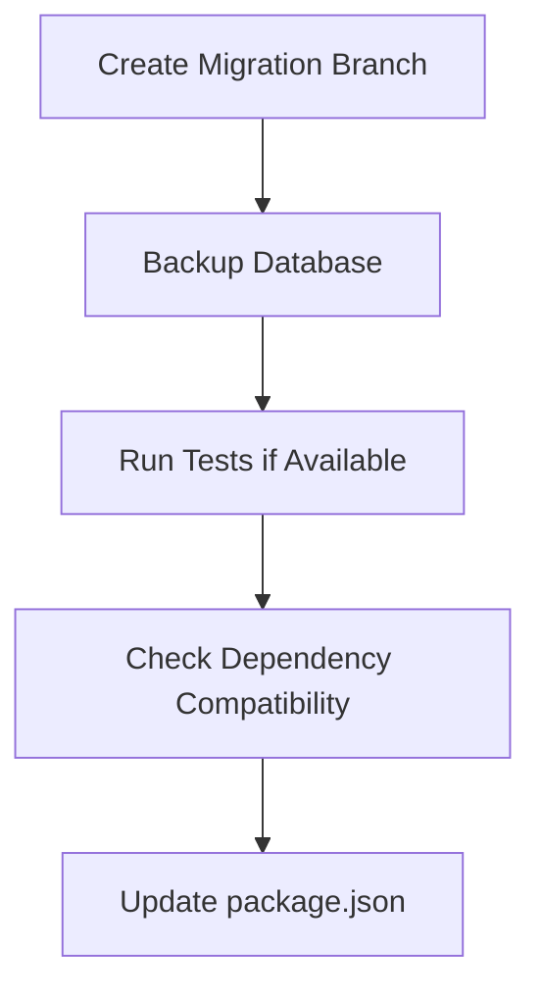
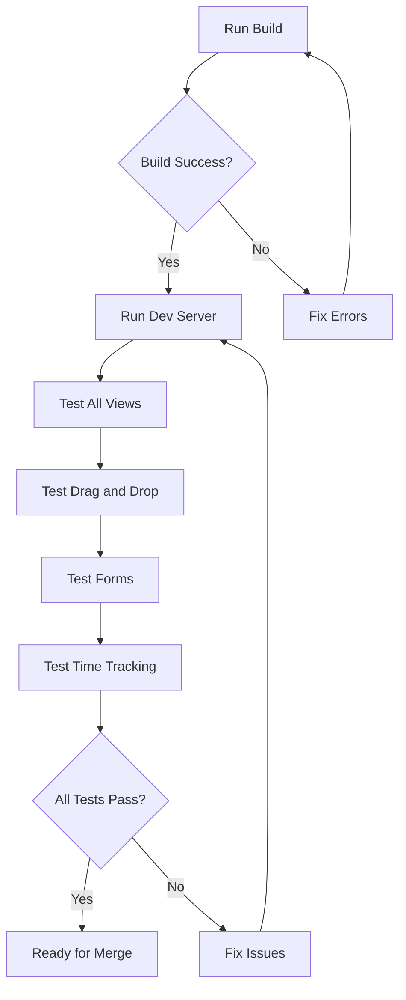

# Next.js 16 Migration Plan for Celestask

## Executive Summary

This document outlines the migration strategy for upgrading Celestask from **Next.js 15.5.12 + React 18.2.0** to **Next.js 16 + React 19.2**. The migration involves significant architectural changes including a new bundler (Turbopack), async route parameters, and React 19 compatibility.

---

## 1. Current vs Target Versions

| Package | Current Version | Target Version | Notes |
|---------|----------------|----------------|-------|
| next | ^15.5.12 | ^16.x | Major version upgrade |
| react | ^18.2.0 | ^19.2.0 | Major version upgrade |
| react-dom | ^18.2.0 | ^19.2.0 | Major version upgrade |
| typescript | ^5.3.3 | ^5.3.3 | Already meets min 5.1+ |
| @types/react | ^18.2.43 | ^19.x | Update for React 19 |
| @types/react-dom | ^18.2.17 | ^19.x | Update for React 19 |
| eslint-config-next | ^15.5.12 | ^16.x | Update with Next.js |

---

## 2. Next.js 16 Key Changes

### 2.1 Breaking Changes (Must Address)

| Change | Impact | Project Files Affected |
|--------|--------|------------------------|
| **Async params/searchParams** | Route params must be awaited | [`[projectId]/[view]/page.tsx`](client/src/app/projects/[projectId]/[view]/page.tsx), [`people/page.tsx`](client/src/app/people/page.tsx), [`page.tsx`](client/src/app/page.tsx) |
| **Node.js 20.9+ required** | Minimum version | Already on Node 22+ ✅ |
| **TypeScript 5.1+ required** | Minimum version | Already on 5.3.3 ✅ |
| **middleware.ts → proxy.ts** | File rename | Not used in current project ✅ |
| **experimental.ppr removed** | Config cleanup | Not used in current project ✅ |
| **next lint removed** | Use ESLint CLI directly | Update scripts if needed |

### 2.2 New Features Available

| Feature | Description | Recommendation |
|---------|-------------|----------------|
| **Turbopack (stable)** | 2-5x faster builds, 10x faster refresh | Enable by default |
| **React 19.2** | View Transitions, useEffectEvent, Activity | Adopt incrementally |
| **Cache Components** | Explicit caching with "use cache" | Evaluate for future |
| **React Compiler** | Automatic memoization | Evaluate for performance |
| **Layout Deduplication** | Shared layouts load once | Automatic benefit |

---

## 3. Pre-Migration Checklist

### 3.1 Environment Requirements ✅
- [x] Node.js 22+ (project requires >=22 <25)
- [x] TypeScript 5.3.3 (meets minimum 5.1+)
- [ ] Backup database and test migration on branch

### 3.2 Dependency Compatibility Research Required

| Package | Current | React 19 Notes | Action Needed |
|---------|---------|----------------|---------------|
| @radix-ui/react-dialog | ^1.0.5 | Check compatibility | Test |
| @radix-ui/react-dropdown-menu | ^2.0.6 | Check compatibility | Test |
| @radix-ui/react-select | ^2.0.0 | Check compatibility | Test |
| @radix-ui/react-slot | ^1.0.2 | Check compatibility | Test |
| @dnd-kit/core | ^6.1.0 | Check compatibility | Test |
| @dnd-kit/sortable | ^8.0.0 | Check compatibility | Test |
| react-big-calendar | ^1.8.5 | Known issues possible | May need upgrade |
| recharts | ^2.10.0 | Check compatibility | Test |
| react-markdown | ^9.0.0 | Check compatibility | Test |
| date-fns | ^2.30.0 | Should work | Test |

---

## 4. Migration Steps

### Phase 1: Preparation



#### Step 1.1: Create Migration Branch
```bash
git checkout -b upgrade/nextjs-16
```

#### Step 1.2: Backup Database
```bash
cp server/data/celestask.db server/data/celestask.db.backup
```

### Phase 2: Update Dependencies

#### Step 2.1: Update package.json

Update [`client/package.json`](client/package.json):

```json
{
  "dependencies": {
    "next": "^16.0.0",
    "react": "^19.2.0",
    "react-dom": "^19.2.0"
  },
  "devDependencies": {
    "@types/react": "^19.0.0",
    "@types/react-dom": "^19.0.0",
    "eslint-config-next": "^16.0.0"
  }
}
```

#### Step 2.2: Install Updated Dependencies
```bash
cd client && npm install
```

### Phase 3: Code Changes

#### Step 3.1: Update Dynamic Route Pages (CRITICAL)

**File: [`client/src/app/projects/[projectId]/[view]/page.tsx`](client/src/app/projects/[projectId]/[view]/page.tsx)**

```typescript
// ❌ Before (Next.js 15)
export default function ProjectViewPage({ 
  params, 
  searchParams 
}: ProjectViewPageProps) {
  const projectId = parseInt(params.projectId);
  const view = params.view as ViewType;
  // ...
}

// ✅ After (Next.js 16)
export default async function ProjectViewPage({ 
  params, 
  searchParams 
}: ProjectViewPageProps) {
  const { projectId: projectIdStr, view: viewStr } = await params;
  const projectId = parseInt(projectIdStr);
  const view = viewStr as ViewType;
  // ...
}
```

**File: [`client/src/app/people/page.tsx`](client/src/app/people/page.tsx)**

If it uses searchParams, update similarly:

```typescript
// ❌ Before
export default function PeoplePage({ searchParams }: { searchParams: { [key: string]: string } }) {
  // ...
}

// ✅ After
export default async function PeoplePage({ searchParams }: { searchParams: Promise<{ [key: string]: string }> }) {
  const resolvedSearchParams = await searchParams;
  // ...
}
```

#### Step 3.2: Update Type Definitions

Update [`client/src/types/index.ts`](client/src/types/index.ts) if any route param types need updating:

```typescript
// Add Promise types for route params
export type PageParams = Promise<{
  projectId: string;
  view: string;
}>;

export type SearchParams = Promise<{
  [key: string]: string | string[] | undefined;
}>;
```

#### Step 3.3: Update next.config.mjs

Update [`client/next.config.mjs`](client/next.config.mjs):

```javascript
const nextConfig = {
  outputFileTracingRoot: __dirname,
  
  // Update if using Turbopack features
  // experimental: {
  //   turbopackFileSystemCacheForDev: true,
  // },
  
  typescript: {
    ignoreBuildErrors: process.env.NEXT_IGNORE_BUILD_ERRORS === 'true',
  },
  
  async rewrites() {
    return [
      {
        source: '/api/:path*',
        destination: `http://localhost:${process.env.BACKEND_PORT || '19096'}/api/:path*`,
      },
    ];
  },
};

export default nextConfig;
```

### Phase 4: React 19 Context Compatibility

The project uses 12+ React Context providers in [`client/src/context/`](client/src/context/). Test each context:

| Context | File | React 19 Notes |
|---------|------|----------------|
| AppContext | [`AppContext.tsx`](client/src/context/AppContext.tsx) | Test useReducer, useState |
| ToastContext | [`ToastContext.tsx`](client/src/context/ToastContext.tsx) | Test useState |
| ProjectContext | [`ProjectContext.tsx`](client/src/context/ProjectContext.tsx) | Test async data fetching |
| TaskContext | [`TaskContext.tsx`](client/src/context/TaskContext.tsx) | Test complex state |
| PeopleContext | [`PeopleContext.tsx`](client/src/context/PeopleContext.tsx) | Test data fetching |
| TagContext | [`TagContext.tsx`](client/src/context/TagContext.tsx) | Test data fetching |
| NoteContext | [`NoteContext.tsx`](client/src/context/NoteContext.tsx) | Test data fetching |
| CustomFieldContext | [`CustomFieldContext.tsx`](client/src/context/CustomFieldContext.tsx) | Test Map usage |
| SavedViewContext | [`SavedViewContext.tsx`](client/src/context/SavedViewContext.tsx) | Test data fetching |
| ShortcutContext | [`ShortcutContext.tsx`](client/src/context/ShortcutContext.tsx) | Test event handlers |
| CommandPaletteContext | [`CommandPaletteContext.tsx`](client/src/context/CommandPaletteContext.tsx) | Test simple state |
| TimeEntryContext | [`TimeEntryContext.tsx`](client/src/context/TimeEntryContext.tsx) | Test timer logic |
| PomodoroContext | [`PomodoroContext.tsx`](client/src/context/PomodoroContext.tsx) | Test interval logic |

### Phase 5: Testing & Validation



#### Test Checklist:
- [ ] `npm run build` completes without errors
- [ ] `npm run dev` starts successfully
- [ ] Home page redirects correctly
- [ ] All 5 views work: Dashboard, Kanban, List, Calendar, Timeline
- [ ] People page loads
- [ ] Drag and drop in Kanban works
- [ ] Forms submit correctly
- [ ] Time tracking functionality
- [ ] Context menus work
- [ ] Command palette works (Cmd+K)
- [ ] Dark mode toggle works
- [ ] All toast notifications display

---

## 5. Rollback Plan

If migration fails:

1. **Revert package.json changes:**
   ```bash
   git checkout client/package.json client/package-lock.json
   ```

2. **Reinstall old dependencies:**
   ```bash
   cd client && rm -rf node_modules && npm install
   ```

3. **Revert code changes:**
   ```bash
   git checkout client/src/app/
   ```

4. **Restore database if needed:**
   ```bash
   cp server/data/celestask.db.backup server/data/celestask.db
   ```

---

## 6. Potential Issues & Solutions

### Issue 1: react-big-calendar Compatibility
**Symptoms:** Type errors or runtime errors with calendar
**Solution:** Check for React 19 compatible version or patch types

### Issue 2: @dnd-kit React 19 Issues
**Symptoms:** Drag and drop not working
**Solution:** Update to latest @dnd-kit versions that support React 19

### Issue 3: Radix UI Type Errors
**Symptoms:** Type mismatches in dialog/dropdown components
**Solution:** Update Radix packages to React 19 compatible versions

### Issue 4: Context Provider Issues
**Symptoms:** State not updating correctly
**Solution:** Review React 19 strict mode changes and effect behavior

---

## 7. Post-Migration Benefits

After successful migration:

1. **Build Performance:** 2-5x faster production builds with Turbopack
2. **Development Speed:** Up to 10x faster Hot Module Replacement
3. **React 19 Features:** Access to View Transitions, useEffectEvent
4. **Better Caching:** Explicit cache control with Cache Components
5. **Layout Optimization:** Shared layouts only load once

---

## 8. Migration Command Summary

```bash
# Phase 1: Preparation
git checkout -b upgrade/nextjs-16
cp server/data/celestask.db server/data/celestask.db.backup

# Phase 2: Update dependencies
cd client
npm install next@latest react@latest react-dom@latest
npm install -D @types/react@latest @types/react-dom@latest eslint-config-next@latest

# Phase 3: Build and test
npm run build
npm run dev

# After successful testing:
# Merge PR and deploy
```

---

## 9. References

- [Next.js 16 Official Release Notes](https://nextjs.org/blog/next-16)
- [Next.js 16 Upgrade Guide](https://nextjs.org/docs/app/building-your-application/upgrading/version-16)
- [React 19 Upgrade Guide](https://react.dev/blog/2024/04/25/react-19-upgrade-guide)
- [Turbopack Documentation](https://turbo.build/pack/docs)

---

## 10. Appendix: Files Requiring Changes

### High Priority (Breaking Changes)
| File | Change Type |
|------|-------------|
| [`client/package.json`](client/package.json) | Dependency updates |
| [`client/src/app/projects/[projectId]/[view]/page.tsx`](client/src/app/projects/[projectId]/[view]/page.tsx) | Async params |
| [`client/src/app/page.tsx`](client/src/app/page.tsx) | Check for params usage |
| [`client/src/types/index.ts`](client/src/types/index.ts) | Type updates |

### Medium Priority (Configuration)
| File | Change Type |
|------|-------------|
| [`client/next.config.mjs`](client/next.config.mjs) | Config updates |
| [`client/tsconfig.json`](client/tsconfig.json) | Review if needed |

### Low Priority (Optional Features)
| File | Change Type |
|------|-------------|
| [`client/tailwind.config.js`](client/tailwind.config.js) | No changes expected |
| [`client/components.json`](client/components.json) | May need shadcn update |
