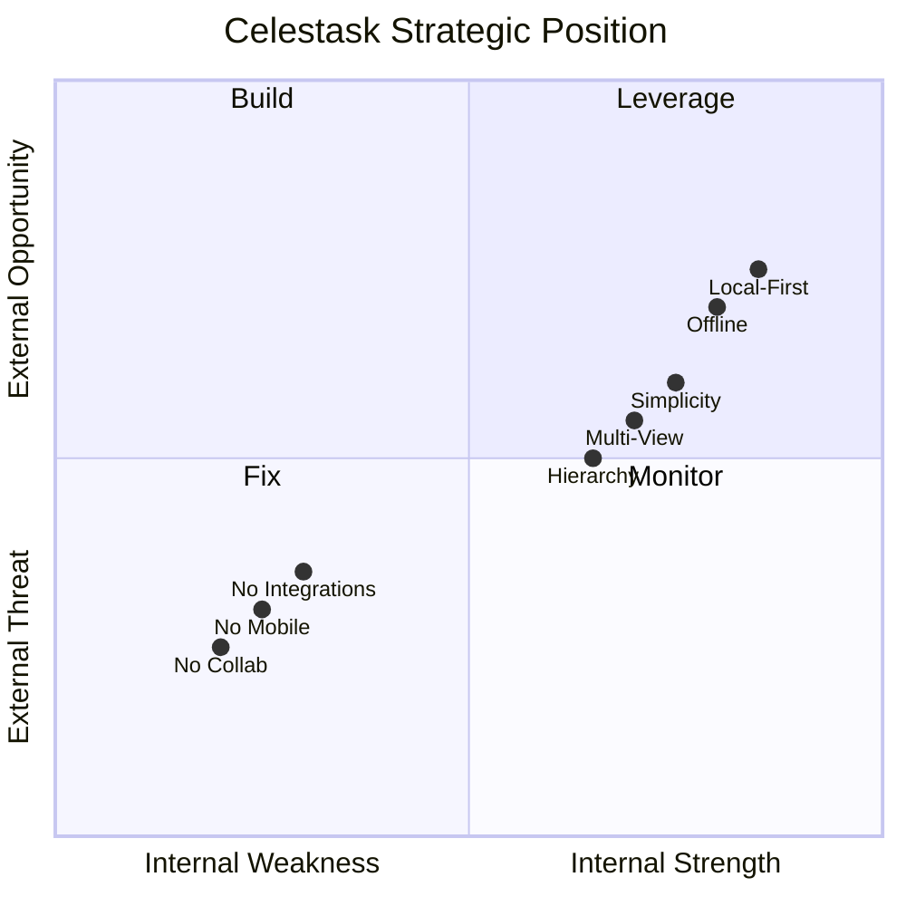
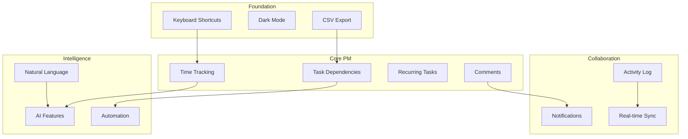

# Celestask Product Strategy & Competitive Feature Audit

**Version:** v1.3.0 Analysis  
**Date:** February 2026  
**Author:** Product Strategy Analysis  

---

## Executive Summary

Celestask is a **local-first, single-user project management tool** positioned as a simplified Jira alternative. After comprehensive analysis against 6 major competitors, this audit identifies **47 feature recommendations** categorized into Quick Wins, Major Releases, and Long-term Roadmap items.

### Key Strategic Findings

| Category | Finding |
|----------|---------|
| **Primary Advantage** | Local-first architecture with offline capability - unique in PM space |
| **Primary Gap** | Lack of task dependencies and smart/automation features |
| **Blue Ocean** | Privacy-focused PM with optional sync - hybrid local/cloud approach |
| **Quick Wins Available** | 15 features that can be implemented rapidly |

---

## Part 1: Competitive Analysis

### 1.1 Competitor Comparison Matrix

| Feature Area | Celestask | Jira | Linear | Notion | Todoist | ClickUp | Obsidian |
|-------------|:--------:|:----:|:------:|:------:|:-------:|:-------:|:--------:|
| **Local-First** | ✅ | ❌ | ❌ | ❌ | ❌ | ❌ | ✅ |
| **Offline Capable** | ✅ | ❌ | ❌ | Partial | ❌ | ❌ | ✅ |
| **Project Nesting** | ✅ Infinite | ✅ | ✅ | ✅ | ✅ | ✅ | ✅ |
| **Task Hierarchy** | ✅ Infinite | ✅ | ✅ | ✅ | ✅ Subtasks | ✅ | ❌ |
| **Multiple Views** | 6 Views | 10+ | 5 | 4 | 4 | 15+ | 1 |
| **Kanban Board** | ✅ | ✅ | ✅ | ✅ | ✅ | ✅ | ❌ |
| **Timeline/Gantt** | ✅ Basic | ✅ Advanced | ✅ | ❌ | ❌ | ✅ | ❌ |
| **Calendar View** | ✅ | ✅ | ✅ | ❌ | ❌ | ✅ | ❌ |
| **Progress Tracking** | ✅ | ✅ | ✅ | ❌ | ❌ | ✅ | ❌ |
| **Time Tracking** | ❌ | ✅ | ✅ | ❌ | ❌ | ✅ | ❌ |
| **Task Dependencies** | ❌ | ✅ | ✅ | ❌ | ❌ | ✅ | ❌ |
| **Recurring Tasks** | ❌ | ✅ | ❌ | ❌ | ✅ | ✅ | ❌ |
| **Templates** | ❌ | ✅ | ❌ | ✅ | ❌ | ✅ | ✅ |
| **Automation/Rules** | ❌ | ✅ | ✅ | ❌ | ❌ | ✅ | ❌ |
| **AI Features** | ❌ | ✅ | ✅ | ✅ | ❌ | ✅ | ❌ |
| **Import/Export** | ❌ | ✅ | ✅ | ✅ | ✅ | ✅ | ✅ |
| **API/Webhooks** | ❌ | ✅ | ✅ | ✅ | ✅ | ✅ | ❌ |
| **Mobile App** | ❌ | ✅ | ✅ | ✅ | ✅ | ✅ | ✅ |
| **Real-time Collab** | ❌ | ✅ | ✅ | ✅ | ❌ | ✅ | ❌ |
| **Comments** | ❌ | ✅ | ✅ | ✅ | ❌ | ✅ | ❌ |
| **Notifications** | ❌ | ✅ | ✅ | ✅ | ✅ | ✅ | ❌ |
| **Dark Mode** | ❌ | ✅ | ✅ | ✅ | ✅ | ✅ | ✅ |
| **Keyboard Shortcuts** | ❌ | ✅ | ✅ | ✅ | ✅ | ✅ | ✅ |
| **Price** | Free | $7.75+/mo | $8+/mo | $8+/mo | $4+/mo | $7+/mo | Free |

### 1.2 Competitive Positioning Analysis

#### vs. Jira (Enterprise PM)
| Aspect | Celestask Position |
|--------|-------------------|
| **Advantages** | Simplicity, no learning curve, local-first privacy, no subscription |
| **Gaps** | No automation, no workflows, limited reporting, no agile artifacts |
| **Strategy** | Target Jira refugees wanting simplicity; individuals/small teams |

#### vs. Linear (Modern Issue Tracking)
| Aspect | Celestask Position |
|--------|-------------------|
| **Advantages** | Local-first, offline, privacy, no vendor lock-in |
| **Gaps** | Missing keyboard shortcuts, no automation, no GitHub-like workflows |
| **Strategy** | Appeal to developers who value data ownership |

#### vs. Notion (All-in-One Workspace)
| Aspect | Celestask Position |
|--------|-------------------|
| **Advantages** | Purpose-built for PM, faster, more structured |
| **Gaps** | No databases, no wiki-style pages, limited flexibility |
| **Strategy** | Focus on structured task management over flexible docs |

#### vs. Todoist/Things (Personal Task Management)
| Aspect | Celestask Position |
|--------|-------------------|
| **Advantages** | More views, project hierarchy, team features |
| **Gaps** | No quick capture, no natural language input, no mobile |
| **Strategy** | Position as upgrade path from simple todo apps |

#### vs. ClickUp (Feature-Rich PM)
| Aspect | Celestask Position |
|--------|-------------------|
| **Advantages** | Simpler, focused, faster, no bloat |
| **Gaps** | Missing many features (time tracking, dependencies, automation) |
| **Strategy** | Be the anti-ClickUp - simple but powerful |

#### vs. Obsidian (Local-First Knowledge)
| Aspect | Celestask Position |
|--------|-------------------|
| **Advantages** | Purpose-built PM with views, structured data |
| **Gaps** | No linking/graph view, no plugins ecosystem |
| **Strategy** | Position as task-focused complement to knowledge tools |

### 1.3 SWOT Analysis



#### Strengths
- **Local-first architecture** - Unique differentiator in PM market
- **Zero cost, zero subscription** - No vendor lock-in
- **Infinite nesting** - More flexible than most competitors
- **6 comprehensive views** - Matches Linear, exceeds Todoist
- **Progress tracking with rollup** - Enterprise feature in personal tool
- **Markdown notes** - Flexible documentation

#### Weaknesses
- **No mobile app** - Critical for personal task management
- **No collaboration features** - Limits team adoption
- **No automation/smart features** - Manual management only
- **No integrations** - Isolated from other tools
- **No task dependencies** - Can't model complex workflows
- **No time tracking** - Only estimates, no actual logging

#### Opportunities
- **Privacy-conscious users** - Growing market segment
- **Jira refugees** - Users wanting simpler alternatives
- **Offline workers** - Digital nomads, travelers
- **Developer market** - Local-first appeals to technical users
- **Obsidian/Notion integrations** - Partner with knowledge tools

#### Threats
- **Linear mobile** - If Linear adds offline, competitive advantage diminishes
- **Notion Databases** - Continuous improvement may close gap
- **ClickUp simplification** - If they add simplified mode
- **AI-powered PM tools** - Emerging competitors with AI-first approach

---

## Part 2: Missing Feature Analysis

### 2.1 Productivity Enhancements

#### A. Quick Capture Mechanisms
| Feature | Description | Impact | Complexity |
|---------|-------------|--------|------------|
| **Global Quick Add** | System-wide hotkey to create task from anywhere | High | Medium |
| **Inbox/Quick Entry** | Fast task entry with minimal fields, triage later | High | Low |
| **Email to Task** | Forward email to create task | Medium | High |
| **Browser Extension** | One-click task creation from web pages | Medium | High |

#### B. Templates and Workflows
| Feature | Description | Impact | Complexity |
|---------|-------------|--------|------------|
| **Project Templates** | Pre-configured project structures with tasks | High | Medium |
| **Task Templates** | Save task as template with pre-filled fields | High | Low |
| **Checklist Templates** | Reusable checklists for common workflows | Medium | Low |
| **Workflow Presets** | Pre-defined status workflows for different types | Medium | Medium |

#### C. Recurring Tasks
| Feature | Description | Impact | Complexity |
|---------|-------------|--------|------------|
| **Simple Recurrence** | Daily/weekly/monthly task regeneration | High | Medium |
| **Custom Patterns** | Complex recurrence rules like 2nd Tuesday | Medium | Medium |
| **Completion-Based** | Regenerate X days after completion | Medium | Medium |

#### D. Smart Suggestions
| Feature | Description | Impact | Complexity |
|---------|-------------|--------|------------|
| **Similar Task Detection** | Warn when creating duplicate tasks | Medium | Medium |
| **Smart Assignee** | Suggest assignee based on history | Medium | Medium |
| **Due Date Suggestions** | Suggest dates based on patterns | Low | High |

### 2.2 Data & Analytics

#### A. Time Tracking
| Feature | Description | Impact | Complexity |
|---------|-------------|--------|------------|
| **Timer** | Start/stop timer on tasks | High | Medium |
| **Manual Time Entry** | Log time manually after work | High | Low |
| **Time Reports** | View time by project/person/period | Medium | Medium |
| **Billable Hours** | Track billable vs non-billable time | Low | Medium |

#### B. Advanced Analytics
| Feature | Description | Impact | Complexity |
|---------|-------------|--------|------------|
| **Burndown Charts** | Sprint/task completion velocity | High | Medium |
| **Velocity Tracking** | Track completion rate over sprints | Medium | Medium |
| **Cumulative Flow** | Visualize work in progress stages | Medium | Medium |
| **Cycle Time** | Time from start to completion | Medium | Medium |

#### C. Export & Reporting
| Feature | Description | Impact | Complexity |
|---------|-------------|--------|------------|
| **CSV Export** | Export tasks/projects to CSV | High | Low |
| **JSON Export** | Full data export in JSON format | Medium | Low |
| **PDF Reports** | Generate printable status reports | Medium | Medium |
| **Scheduled Reports** | Auto-generate and email reports | Low | High |

### 2.3 Collaboration (Future-Proofing)

#### A. Communication
| Feature | Description | Impact | Complexity |
|---------|-------------|--------|------------|
| **Task Comments** | Threaded comments on tasks | High | Medium |
| **Project Discussions** | Discussion threads on projects | Medium | Medium |
| **@Mentions** | Mention people in comments/notes | High | Medium |
| **Reactions** | Emoji reactions to comments | Low | Low |

#### B. Notifications
| Feature | Description | Impact | Complexity |
|---------|-------------|--------|------------|
| **In-App Notifications** | Bell icon with notification center | High | Medium |
| **Email Notifications** | Daily digests, mention alerts | Medium | High |
| **Browser Notifications** | Desktop push notifications | Medium | Medium |
| **Due Date Reminders** | Configurable reminders before due | High | Medium |

#### C. Activity Tracking
| Feature | Description | Impact | Complexity |
|---------|-------------|--------|------------|
| **Activity Log** | Track all changes with history | High | Medium |
| **Task History** | View change history per task | High | Medium |
| **Restore Points** | Snapshots for recovery | Medium | High |
| **Audit Trail** | Detailed action logging | Low | Medium |

### 2.4 Integrations & Ecosystem

#### A. Calendar Sync
| Feature | Description | Impact | Complexity |
|---------|-------------|--------|------------|
| **iCal Feed** | Subscribe to tasks in any calendar | High | Medium |
| **Google Calendar** | Two-way sync with Google | High | High |
| **Outlook Calendar** | Two-way sync with Outlook | Medium | High |
| **Apple Calendar** | Two-way sync with Apple | Medium | High |

#### B. Import/Export
| Feature | Description | Impact | Complexity |
|---------|-------------|--------|------------|
| **Jira Import** | Import projects from Jira CSV | High | Medium |
| **Trello Import** | Import boards from Trello | High | Medium |
| **Asana Import** | Import from Asana | Medium | Medium |
| **Todoist Import** | Import from Todoist | Medium | Medium |

#### C. API & Extensions
| Feature | Description | Impact | Complexity |
|---------|-------------|--------|------------|
| **REST API Documentation** | Public API docs | High | Low |
| **API Keys** | Generate/manage API keys | High | Medium |
| **Webhooks** | Event-driven integrations | Medium | Medium |
| **Plugin System** | Extensibility framework | Low | High |

### 2.5 Advanced Task Management

#### A. Task Dependencies
| Feature | Description | Impact | Complexity |
|---------|-------------|--------|------------|
| **Blocking Relationship** | Task A blocks Task B | High | Medium |
| **Dependent Relationship** | Task A requires Task B | High | Medium |
| **Related Tasks** | Soft link between tasks | Medium | Low |
| **Duplicate Detection** | Flag potential duplicates | Medium | Medium |
| **Critical Path** | Highlight blocking chain | Medium | High |

#### B. Custom Fields
| Feature | Description | Impact | Complexity |
|---------|-------------|--------|------------|
| **Text Fields** | Custom text fields on tasks | Medium | Medium |
| **Number Fields** | Custom numeric fields | Medium | Medium |
| **Select Fields** | Custom dropdown options | High | Medium |
| **Date Fields** | Additional date fields | Medium | Medium |
| **Formula Fields** | Computed values | Low | High |

#### C. Advanced Filtering
| Feature | Description | Impact | Complexity |
|---------|-------------|--------|------------|
| **Saved Filters** | Save and name filter combinations | High | Low |
| **Filter Sharing** | Share filter configurations | Low | Medium |
| **Cross-Project Filters** | Filter across all projects | Medium | Medium |

### 2.6 Smart/AI Features

#### A. Natural Language Processing
| Feature | Description | Impact | Complexity |
|---------|-------------|--------|------------|
| **NLP Task Creation** | Parse task due tomorrow at 5pm | High | High |
| **Smart Date Parsing** | Interpret next week, in 3 days | High | Medium |
| **Priority Inference** | Auto-detect priority from text | Low | High |

#### B. AI Assistance
| Feature | Description | Impact | Complexity |
|---------|-------------|--------|------------|
| **Task Breakdown** | AI suggests sub-tasks | Medium | High |
| **Summary Generation** | AI summarizes long descriptions | Low | High |
| **Smart Search** | Natural language search queries | Medium | High |

---

## Part 3: Prioritized Recommendations

### 3.1 🔴 Quick Wins (1-3 Days Implementation)

High impact, low effort features that immediately improve user experience.

| # | Feature | Pain Point Solved | Competitive Advantage | Complexity | User Impact |
|---|---------|-------------------|----------------------|------------|-------------|
| 1 | **Keyboard Shortcuts** | Power users frustrated by mouse dependency | Match Linear/Jira efficiency | Low | 9/10 |
| 2 | **Dark Mode** | Eye strain, preference for dark UI | Match all major competitors | Low | 8/10 |
| 3 | **Task Copy/Duplicate** | Recreating similar tasks manually | Basic feature expectation | Low | 8/10 |
| 4 | **Bulk Actions** | Managing multiple tasks one by one | Efficiency for cleanup | Low | 8/10 |
| 5 | **CSV Export** | Cannot get data out of system | Data portability, backup | Low | 9/10 |
| 6 | **Quick Add Inbox** | Creating tasks requires full form | Reduce friction for capture | Low | 9/10 |
| 7 | **Saved Filters** | Re-applying same filters repeatedly | Workflow efficiency | Low | 7/10 |
| 8 | **Task Archiving** | Completed tasks clutter views | Clean workspace | Low | 7/10 |
| 9 | **Due Date Reminders** | Missing deadlines | Core PM expectation | Medium | 9/10 |
| 10 | **Task Templates** | Recreating similar task structures | Workflow efficiency | Low | 8/10 |
| 11 | **Project Archiving** | Old projects clutter sidebar | Clean workspace | Low | 7/10 |
| 12 | **Enhanced Search** | Finding tasks across projects | Data discovery | Low | 8/10 |
| 13 | **Sort Persistence** | Re-sorting every session | UX annoyance fix | Low | 6/10 |
| 14 | **Task Count Badges** | Not knowing task counts at glance | Quick project health view | Low | 7/10 |
| 15 | **Improved Empty States** | Confusion when no data | First-time user experience | Low | 6/10 |

### 3.2 🟡 Major Feature Releases (1-4 Weeks Implementation)

Significant value adds requiring planning and iteration.

| # | Feature | Pain Point Solved | Competitive Advantage | Complexity | User Impact |
|---|---------|-------------------|----------------------|------------|-------------|
| 16 | **Task Dependencies** | Cannot model work sequences | Match Jira/Linear/ClickUp | Medium | 10/10 |
| 17 | **Time Tracking** | Only estimates, no actuals | Match all enterprise PM | Medium | 9/10 |
| 18 | **Recurring Tasks** | Manual recreation of repeating work | Match Todoist/ClickUp | Medium | 9/10 |
| 19 | **Comments System** | No discussion on tasks | Basic collaboration | Medium | 8/10 |
| 20 | **Activity Log** | No visibility into changes | Audit capability | Medium | 8/10 |
| 21 | **Project Templates** | Recreating project structures | Onboarding efficiency | Medium | 8/10 |
| 22 | **iCal Feed** | Tasks not in calendar app | Calendar integration | Medium | 9/10 |
| 23 | **Burndown Charts** | No velocity metrics | Agile capability | Medium | 7/10 |
| 24 | **JSON Import/Export** | No data portability | Data freedom, backup | Medium | 8/10 |
| 25 | **Custom Statuses** | Limited to 5 fixed statuses | Flexibility | Medium | 7/10 |
| 26 | **In-App Notifications** | No awareness of changes/mentions | Collaboration readiness | Medium | 8/10 |
| 27 | **Task Relationships** | Cannot link related tasks | Knowledge graph | Low | 7/10 |
| 28 | **Advanced Timeline** | Basic Gantt needs enhancement | Match ClickUp | Medium | 7/10 |
| 29 | **Mobile Web PWA** | No mobile access | On-the-go access | Medium | 9/10 |
| 30 | **Global Search** | Limited to single project | Cross-project discovery | Medium | 8/10 |

### 3.3 🟢 Long-term Roadmap Items (1-6 Months Implementation)

Strategic investments requiring platform-level changes.

| # | Feature | Pain Point Solved | Competitive Advantage | Complexity | User Impact |
|---|---------|-------------------|----------------------|------------|-------------|
| 31 | **Natural Language Task Input** | Tedious form filling | Match Todoist AI | High | 9/10 |
| 32 | **Mobile Native App** | No native mobile experience | Match all competitors | High | 10/10 |
| 33 | **Real-time Collaboration** | Single-user limitation | Team market expansion | High | 8/10 |
| 34 | **Google Calendar Sync** | Manual calendar updates | Seamless calendar | High | 9/10 |
| 35 | **Jira/Trello Import** | Migration barrier | Easy onboarding | High | 8/10 |
| 36 | **REST API + Webhooks** | No third-party integrations | Ecosystem building | High | 8/10 |
| 37 | **Automation Rules** | Manual task management | Match Jira/ClickUp | High | 9/10 |
| 38 | **AI Task Suggestions** | Manual prioritization | Differentiator | High | 7/10 |
| 39 | **Custom Fields** | Inflexible data model | Match enterprise PM | High | 8/10 |
| 40 | **Email Integration** | Tasks from emails | Workflow integration | High | 7/10 |
| 41 | **Browser Extension** | Context switching | Quick capture | High | 7/10 |
| 42 | **Reporting Dashboard** | Limited analytics | Executive visibility | High | 8/10 |
| 43 | **Team Workspaces** | No multi-team support | Enterprise readiness | High | 7/10 |
| 44 | **Plugin System** | Limited extensibility | Community growth | High | 6/10 |
| 45 | **Cloud Sync Option** | Data only local | Hybrid flexibility | High | 9/10 |
| 46 | **Advanced Permissions** | No access control | Enterprise feature | High | 6/10 |
| 47 | **White-label Option** | Generic branding | Agency/freelancer market | Medium | 5/10 |

---

## Part 4: Recommended Implementation Phases

### Phase 1: Foundation Strengthening (v1.4.0)
**Focus:** UX Polish & Data Portability

| Priority | Features |
|----------|----------|
| Critical | Keyboard Shortcuts, Dark Mode, CSV Export |
| High | Quick Add Inbox, Saved Filters, Task Templates |
| Medium | Bulk Actions, Task Archiving, Enhanced Search |

### Phase 2: Core PM Capabilities (v1.5.0)
**Focus:** Task Management Maturity

| Priority | Features |
|----------|----------|
| Critical | Task Dependencies, Time Tracking, Recurring Tasks |
| High | Comments System, Activity Log, iCal Feed |
| Medium | Project Templates, Burndown Charts, Custom Statuses |

### Phase 3: Collaboration Readiness (v2.0.0)
**Focus:** Team Features

| Priority | Features |
|----------|----------|
| Critical | Real-time Sync Foundation, User Authentication |
| High | Notifications, @Mentions, Team Workspaces |
| Medium | Email Integration, REST API, Webhooks |

### Phase 4: Intelligence & Ecosystem (v2.1.0+)
**Focus:** Competitive Differentiation

| Priority | Features |
|----------|----------|
| Critical | Mobile App, Natural Language Input |
| High | Automation Rules, Cloud Sync Option |
| Medium | AI Suggestions, Plugin System, Import Tools |

---

## Part 5: Strategic Recommendations

### 5.1 Market Positioning Strategy

```
┌─────────────────────────────────────────────────────────────┐
│                    PM TOOL LANDSCAPE                        │
├─────────────────────────────────────────────────────────────┤
│                                                             │
│  Enterprise         │ Celestask       │ Personal            │
│  ──────────         │ Opportunity     │ ─────────           │
│  Jira               │                 │ Todoist             │
│  ClickUp            │    ┌─────┐      │ Things              │
│  Asana              │    │LOCAL│      │ Apple Reminders     │
│                     │    │FIRST│      │                     │
│  ──────────         │    │ +   │      │ ─────────           │
│  Team Focus         │    │SMART│      │ Individual Focus    │
│                     │    └─────┘      │                     │
│                     │                 │                     │
│  Modern             │                 │ Traditional         │
│  ──────────         │                 │ ─────────           │
│  Linear             │                 │ MS Project          │
│  Notion             │                 │ Excel               │
│                     │                 │                     │
└─────────────────────────────────────────────────────────────┘
```

**Recommended Positioning:**
> "The privacy-first project management tool for individuals and small teams who want enterprise features without enterprise complexity or cost."

### 5.2 Differentiation Strategy

1. **Lean into Local-First**
   - Market offline capability as feature, not limitation
   - Emphasize data ownership and privacy
   - Target privacy-conscious users and regulated industries

2. **Simplicity as Strategy**
   - Be the "un-ClickUp" - powerful but not overwhelming
   - Maintain 6 core views, resist feature bloat
   - Focus on doing fewer things excellently

3. **Hybrid Future**
   - Plan for optional cloud sync (not replacement)
   - Allow users to choose their data location
   - "Your data, your choice" messaging

### 5.3 Competitive Moat Building

| Moat Type | Strategy |
|-----------|----------|
| **Technical** | Local-first with optional sync (hard to replicate) |
| **Data** | Full export/import in standard formats (prevent lock-in as feature) |
| **Network** | Plugin ecosystem, community templates |
| **Brand** | Privacy-first, developer-friendly positioning |

---

## Appendix A: Feature Dependency Graph



---

## Appendix B: Implementation Complexity Reference

| Complexity | Criteria |
|------------|----------|
| **Low** | Frontend-only changes, no DB schema changes, no new APIs |
| **Medium** | New DB tables/columns, new API endpoints, moderate UI work |
| **High** | Architecture changes, external integrations, real-time features |

---

## Appendix C: User Impact Scoring Methodology

| Score | Criteria |
|-------|----------|
| 9-10 | Core workflow improvement, requested by most users |
| 7-8 | Significant quality of life improvement |
| 5-6 | Nice to have, limited user requests |
| 3-4 | Minor improvement, niche use case |
| 1-2 | Minimal impact, rarely requested |

---

**End of Product Strategy & Competitive Audit**

*This document should be reviewed quarterly and updated based on market changes and user feedback.*
